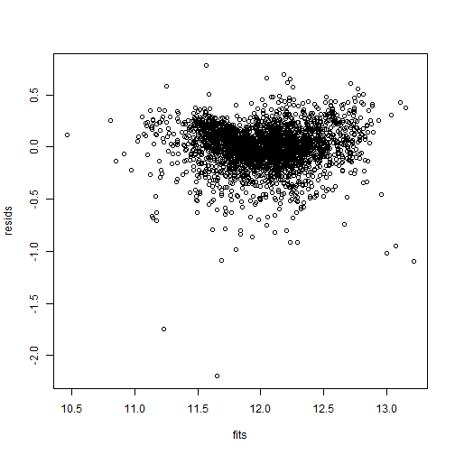
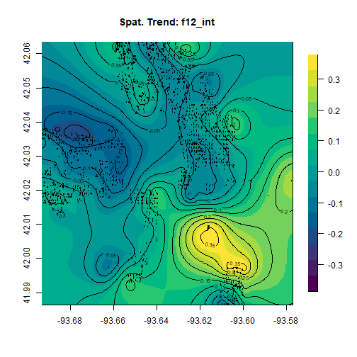

# Models for cross-sectional data

We start our demo with an application of **pspatreg** to the analysis of cross-sectional data. In particular, we use Ames dataset (included in the package **AmesHousing**) which contains data on 2,930 properties in Ames, Iowa. The dataset includes information related to house characteristics (bedrooms, garages, fireplaces, pools, porches, etc.), location characteristics (neighborhood), lot information (zoning, shape, size, etc.), ratings of condition and quality and sale price (from 2006 to 2010). The section is organized as follows:

-   Description of dataset, spatial weights matrix and model specifications;

-   Estimation results of linear spatial models and comparison with the results obtained with the package **spatialreg**;

-   Estimation results of semiparametric spatial models.

## Reading the data

The dataset is a spatial point dataset. It contains  cross-sectional information on 2,930 properties in Ames, Iowa. The raw dataset (`ames`) has been transformed in a spatial point dataset of class `sf` as follows:

```r
library(pspatreg)
library(spdep)
library(sf)
library(ggplot2)
library(dplyr)
ames <- AmesHousing::make_ames()# Raw Ames Housing Data
ames_sf <- st_as_sf(ames, coords = c("Longitude", "Latitude"))
ames_sf$Longitude <- ames$Longitude
ames_sf$Latitude <- ames$Latitude
```
The dependent variable in the regression analysis is *Sale_Price*, while we selected the following variables as covariates:

\- *Lot_Area*: Lot size in square feet

\- *Total_Bsmt_SF*: Total square feet of basement area

\- *Garage_Cars*: Size of garage in car capacity

\- *Gr_Liv_Area*: Above grade (ground) living area square feet

\- *Fireplaces*: Number of fireplaces

Due to the skewed distribution of the dependent variable *Sale_Price*, we use the log-transformation:


```r
ggplot(data = ames_sf) + geom_histogram(mapping = aes(x = Sale_Price))
```


```r
ggplot(data = ames_sf) + geom_histogram(mapping = aes(x = log(Sale_Price)))
```


```r
ames_sf$lnSale_Price <- log(ames_sf$Sale_Price)
ames_sf$lnLot_Area <- log(ames_sf$Lot_Area)
ames_sf$lnTotal_Bsmt_SF <- log(ames_sf$Total_Bsmt_SF+1)
ames_sf$lnGr_Liv_Area <- log(ames_sf$Gr_Liv_Area)
```

## Constructing the spatial weights matrix

Creating spatial weights is a necessary step when using areal data. To do so, it is necessary  to choose a criterion to define the neighbours, and then to assign weights to each of them. 

In particular, we have used a graph-based neighbors list (a Delauney triangulation neighbor list)  after eliminating duplicates in coordinates values (thus the final `sf` object used in the analysis is `ames_sf1`):


```r
ames_sf1 <- ames_sf[duplicated(ames_sf$Longitude) == FALSE,]
coord_sf1 <- cbind(ames_sf1$Longitude, ames_sf1$Latitude)
# Delauney triangulation neighbours (symmetric)
ID <- row.names(as(ames_sf1, "sf"))
col.tri.nb <- tri2nb(coord_sf1)
soi_nb <- graph2nb(soi.graph(col.tri.nb, coord_sf1), row.names = ID)
is.symmetric.nb(soi_nb, verbose = TRUE, force = FALSE)
```

```
## [1] TRUE
```

```r
listW <- nb2listw(soi_nb, style = "W", zero.policy = FALSE)
```

## Defining *formula* for parametric and semiparametric models

We define different *formula* for linear and nonlinear (semiparametric) models with and without a spatial trend. The Durbin *formula* is used for types "sdm", "slx" or "sdem".

In the case of semiparametric terms, in 3d or in 2d (as it is the case of spatial trend), the number of knots used to construct the B-splines basis needs to be specified.


```r
# Linear Model

formlin <- lnSale_Price ~ lnLot_Area + lnTotal_Bsmt_SF + lnGr_Liv_Area +  Garage_Cars + Fireplaces
durbinformlin <- ~ lnLot_Area + lnTotal_Bsmt_SF + lnGr_Liv_Area + Garage_Cars + Fireplaces
# Semiparametric model without spatial trend
formgam <- lnSale_Price ~ Fireplaces + Garage_Cars + 
  pspl(lnLot_Area, nknots = 20) + 
  pspl(lnTotal_Bsmt_SF, nknots = 20) + 
  pspl(lnGr_Liv_Area, nknots = 20) 
# Semiparametric model with spatial trend in 2d
form2d <- lnSale_Price ~ Fireplaces + Garage_Cars + 
  pspl(lnLot_Area, nknots = 20) + 
  pspl(lnTotal_Bsmt_SF, nknots = 20) +
  pspl(lnGr_Liv_Area, nknots = 20) +
  pspt(Longitude,Latitude, 
       nknots = c(10, 10), 
       psanova = FALSE)
# Semiparametric model with PS-ANOVA spatial trend in 2d
form2d_psanova <- lnSale_Price ~ Fireplaces + Garage_Cars + 
  pspl(lnLot_Area, nknots = 20) + 
  pspl(lnTotal_Bsmt_SF, nknots = 20) + 
  pspl(lnGr_Liv_Area, nknots = 20) +
  pspt(Longitude, Latitude, 
       nknots = c(10, 10), 
       psanova = TRUE)
durbinformnonlin <- ~ Fireplaces + Garage_Cars + 
  pspl(lnLot_Area, nknots = 20)
```

## Estimating parametric linear models

We first estimate standard spatial linear autoregressive models using the function `pspatfit()` included in the package **pspatreg** (based, in the default, on the REML estimators) and compare them with the results obtained using the functions provided by the package **spatialreg** (based on the ML estimators).

### Spatial Lag (SAR) model. REML estimates using `pspatfit()`

The SAR model for cross-sectional data can be specified as:
$$y_{i}=\rho \sum_{j=1}^N w_{ij,N} y_{j} + 
\sum_{k=1}^K \beta_k x_{k,i} + \epsilon_{i}$$

$$\epsilon_{i} \sim i.i.d.(0,\sigma^2_\epsilon)$$
To estimate this model, we use the option `type="sar"`:

```r
linsar <- pspatfit(formlin, data = ames_sf1, listw = listW, method = "Chebyshev", type = "sar")
summary(linsar)
```

```
## 
##  Call 
## pspatfit(formula = formlin, data = ames_sf1, listw = listW, type = "sar", 
##     method = "Chebyshev")
## 
##  Parametric Terms 
##                   Estimate Std. Error t value  Pr(>|t|)
## (Intercept)     3.6865265  0.1034704 35.6288 < 2.2e-16
## lnLot_Area      0.0326548  0.0074716  4.3706 1.285e-05
## lnTotal_Bsmt_SF 0.0505097  0.0030506 16.5571 < 2.2e-16
## lnGr_Liv_Area   0.3989679  0.0136384 29.2532 < 2.2e-16
## Garage_Cars     0.1191713  0.0053947 22.0902 < 2.2e-16
## Fireplaces      0.0556142  0.0061149  9.0948 < 2.2e-16
## rho             0.3791495  0.0110059 34.4498 < 2.2e-16
##                    
## (Intercept)     ***
## lnLot_Area      ***
## lnTotal_Bsmt_SF ***
## lnGr_Liv_Area   ***
## Garage_Cars     ***
## Fireplaces      ***
## rho             ***
## ---
## Signif. codes:  
## 0 '***' 0.001 '**' 0.01 '*' 0.05 '.' 0.1 ' ' 1
## 
##  Goodness-of-Fit 
##  
##  EDF Total:      7 
##  Sigma: 0.207252 
##  AIC:  -6438.9 
##  BIC:  -6397.4
```

All $\beta's$ are significant and positive as expected. The estimated spatial autoregressive (0.38) is also positive and significant.

Extract coefficients:


```r
coef(linsar)
```

```
##             rho     (Intercept)      lnLot_Area 
##      0.37914948      3.68652654      0.03265484 
## lnTotal_Bsmt_SF   lnGr_Liv_Area     Garage_Cars 
##      0.05050966      0.39896788      0.11917130 
##      Fireplaces 
##      0.05561421
```

Extract fitted values and residuals:


```r
fits <- fitted(linsar)
plot(fits, ames_sf1$lnSale_Price)
```


```r
resids <- residuals(linsar)
plot(fits, resids)
```



Extract log-likelihood and restricted log-likelihood:


```r
logLik(linsar)
```

```
## 'log Lik.' 3226.45 (df=7)
```

```r
logLik(linsar, REML = TRUE)
```

```
## 'log Lik.' 3195.202 (df=7)
```

Extract the covariance matrix of estimated coefficients. Argument `bayesian` allows to get frequentist (default) or bayesian covariances:


```r
vcov(linsar)
```

```
##                   (Intercept)    lnLot_Area
## (Intercept)      1.070612e-02 -3.455836e-04
## lnLot_Area      -3.455836e-04  5.582407e-05
## lnTotal_Bsmt_SF -3.956653e-05  3.375496e-07
## lnGr_Liv_Area   -1.073699e-03 -2.107405e-05
## Garage_Cars      2.103636e-04 -4.427230e-06
## Fireplaces       2.394816e-04 -6.365539e-06
##                 lnTotal_Bsmt_SF lnGr_Liv_Area
## (Intercept)       -3.956653e-05 -1.073699e-03
## lnLot_Area         3.375496e-07 -2.107405e-05
## lnTotal_Bsmt_SF    9.306362e-06 -2.958404e-06
## lnGr_Liv_Area     -2.958404e-06  1.860070e-04
## Garage_Cars       -2.172014e-06 -2.823467e-05
## Fireplaces        -1.475225e-06 -2.602855e-05
##                   Garage_Cars    Fireplaces
## (Intercept)      2.103636e-04  2.394816e-04
## lnLot_Area      -4.427230e-06 -6.365539e-06
## lnTotal_Bsmt_SF -2.172014e-06 -1.475225e-06
## lnGr_Liv_Area   -2.823467e-05 -2.602855e-05
## Garage_Cars      2.910332e-05 -2.952641e-06
## Fireplaces      -2.952641e-06  3.739236e-05
```

```r
vcov(linsar, bayesian = TRUE)
```

```
##                   (Intercept)    lnLot_Area
## (Intercept)      1.070612e-02 -3.455836e-04
## lnLot_Area      -3.455836e-04  5.582407e-05
## lnTotal_Bsmt_SF -3.956653e-05  3.375496e-07
## lnGr_Liv_Area   -1.073699e-03 -2.107405e-05
## Garage_Cars      2.103636e-04 -4.427230e-06
## Fireplaces       2.394816e-04 -6.365539e-06
##                 lnTotal_Bsmt_SF lnGr_Liv_Area
## (Intercept)       -3.956653e-05 -1.073699e-03
## lnLot_Area         3.375496e-07 -2.107405e-05
## lnTotal_Bsmt_SF    9.306362e-06 -2.958404e-06
## lnGr_Liv_Area     -2.958404e-06  1.860070e-04
## Garage_Cars       -2.172014e-06 -2.823467e-05
## Fireplaces        -1.475225e-06 -2.602855e-05
##                   Garage_Cars    Fireplaces
## (Intercept)      2.103636e-04  2.394816e-04
## lnLot_Area      -4.427230e-06 -6.365539e-06
## lnTotal_Bsmt_SF -2.172014e-06 -1.475225e-06
## lnGr_Liv_Area   -2.823467e-05 -2.602855e-05
## Garage_Cars      2.910332e-05 -2.952641e-06
## Fireplaces      -2.952641e-06  3.739236e-05
```

A print method to get printed coefficients, standard errors and p-values of parametric terms:


```r
print(linsar)
```

```
##                 Estimate Std. Error t value Pr(>|t|)
## (Intercept)       3.6865     0.1035 35.6288        0
## lnLot_Area        0.0327     0.0075  4.3706        0
## lnTotal_Bsmt_SF   0.0505     0.0031 16.5571        0
## lnGr_Liv_Area     0.3990     0.0136 29.2532        0
## Garage_Cars       0.1192     0.0054 22.0902        0
## Fireplaces        0.0556     0.0061  9.0948        0
## rho               0.3791     0.0110 34.4498        0
```

Computing average direct, indirect and total marginal impacts:


```r
imp_parvar_sar <- impactspar(linsar, list_varpar)
summary(imp_parvar_sar)
```

```
## 
##  Total Parametric Impacts (sar) 
##                   Estimate Std. Error    t value
## lnLot_Area       0.0536790  0.0124839  4.2998599
## lnTotal_Bsmt_SF  0.0814270  0.0051877 15.6962115
## lnGr_Liv_Area    0.6419914  0.0251144 25.5626310
## Garage_Cars      0.1917485  0.0089729 21.3696361
## Fireplaces       0.0895817  0.0100642  8.9010129
##                 Pr(>|t|)
## lnLot_Area             0
## lnTotal_Bsmt_SF        0
## lnGr_Liv_Area          0
## Garage_Cars            0
## Fireplaces             0
## 
##  Direct Parametric Impacts (sar) 
##                   Estimate Std. Error    t value
## lnLot_Area       0.0361870  0.0084145  4.3005421
## lnTotal_Bsmt_SF  0.0548870  0.0033652 16.3102969
## lnGr_Liv_Area    0.4327441  0.0151430 28.5771987
## Garage_Cars      0.1292540  0.0056766 22.7695863
## Fireplaces       0.0603794  0.0066608  9.0648617
##                 Pr(>|t|)
## lnLot_Area             0
## lnTotal_Bsmt_SF        0
## lnGr_Liv_Area          0
## Garage_Cars            0
## Fireplaces             0
## 
##  Indirect Parametric Impacts (sar) 
##                   Estimate Std. Error    t value
## lnLot_Area       0.0174920  0.0041086  4.2573612
## lnTotal_Bsmt_SF  0.0265400  0.0019946 13.3057034
## lnGr_Liv_Area    0.2092473  0.0117278 17.8419512
## Garage_Cars      0.0624945  0.0038048 16.4252430
## Fireplaces       0.0292024  0.0035213  8.2930647
##                 Pr(>|t|)
## lnLot_Area             0
## lnTotal_Bsmt_SF        0
## lnGr_Liv_Area          0
## Garage_Cars            0
## Fireplaces             0
```

As expected, all marginal impacts are strongly significant and spillover impacts are rather high. We compare these results with those obtained using ML estimates with `lagsarlm()` (package **spatialreg**):


```r
spatregsar <- spatialreg::lagsarlm(formlin, data = ames_sf1, listw = listW, method = "Chebyshev") 
summary(spatregsar)
```

```
## 
## Call:
## spatialreg::lagsarlm(formula = formlin, data = ames_sf1, listw = listW, 
##     method = "Chebyshev")
## 
## Residuals:
##       Min        1Q    Median        3Q       Max 
## -2.198831 -0.083148  0.013960  0.103624  0.833730 
## 
## Type: lag 
## Coefficients: (numerical Hessian approximate standard errors) 
##                  Estimate Std. Error z value  Pr(>|z|)
## (Intercept)     3.6844777  0.1412854 26.0783 < 2.2e-16
## lnLot_Area      0.0326445  0.0074560  4.3783 1.196e-05
## lnTotal_Bsmt_SF 0.0504993  0.0030832 16.3790 < 2.2e-16
## lnGr_Liv_Area   0.3988905  0.0140935 28.3031 < 2.2e-16
## Garage_Cars     0.1191234  0.0058386 20.4026 < 2.2e-16
## Fireplaces      0.0555984  0.0061575  9.0293 < 2.2e-16
## 
## Rho: 0.37939, LR test value: 881.13, p-value: < 2.22e-16
## Approximate (numerical Hessian) standard error: 0.011203
##     z-value: 33.866, p-value: < 2.22e-16
## Wald statistic: 1146.9, p-value: < 2.22e-16
## 
## Log likelihood: 674.5642 for lag model
## ML residual variance (sigma squared): 0.033305, (sigma: 0.1825)
## Number of observations: 2777 
## Number of parameters estimated: 8 
## AIC: -1333.1, (AIC for lm: -454)
```

```r
W <- as(listW, "CsparseMatrix")
trMatc <- spatialreg::trW(W, type="mult")
set.seed(1)
spatialreg::impacts(spatregsar,listw=listW)
```

```
## Impact measures (lag, exact):
##                     Direct   Indirect      Total
## lnLot_Area      0.03543086 0.01716969 0.05260055
## lnTotal_Bsmt_SF 0.05480964 0.02656058 0.08137023
## lnGr_Liv_Area   0.43293730 0.20980007 0.64273737
## Garage_Cars     0.12929103 0.06265403 0.19194505
## Fireplaces      0.06034395 0.02924249 0.08958644
```

```r
SAR.impact <- spatialreg::impacts(spatregsar, tr = trMatc, R=200)
list_varpar <- as.character(names(summary(linsar)$bfixed[-1]))
imp_parvar <- impactspar(linsar, list_varpar)
summary(imp_parvar)
```

```
## 
##  Total Parametric Impacts (sar) 
##                   Estimate Std. Error    t value
## lnLot_Area       0.0526351  0.0126615  4.1570959
## lnTotal_Bsmt_SF  0.0815539  0.0051937 15.7024068
## lnGr_Liv_Area    0.6424915  0.0254110 25.2840244
## Garage_Cars      0.1919770  0.0091065 21.0812687
## Fireplaces       0.0893651  0.0099387  8.9916619
##                 Pr(>|t|)
## lnLot_Area             0
## lnTotal_Bsmt_SF        0
## lnGr_Liv_Area          0
## Garage_Cars            0
## Fireplaces             0
## 
##  Direct Parametric Impacts (sar) 
##                   Estimate Std. Error    t value
## lnLot_Area       0.0354502  0.0085096  4.1659217
## lnTotal_Bsmt_SF  0.0549261  0.0033748 16.2754581
## lnGr_Liv_Area    0.4326923  0.0149163 29.0079861
## Garage_Cars      0.1292944  0.0057207 22.6010669
## Fireplaces       0.0601890  0.0066384  9.0668429
##                 Pr(>|t|)
## lnLot_Area             0
## lnTotal_Bsmt_SF        0
## lnGr_Liv_Area          0
## Garage_Cars            0
## Fireplaces             0
## 
##  Indirect Parametric Impacts (sar) 
##                   Estimate Std. Error    t value
## lnLot_Area       0.0171849  0.0041906  4.1008494
## lnTotal_Bsmt_SF  0.0266278  0.0020066 13.2701474
## lnGr_Liv_Area    0.2097992  0.0122025 17.1930826
## Garage_Cars      0.0626825  0.0039144 16.0131432
## Fireplaces       0.0291761  0.0034323  8.5005383
##                 Pr(>|t|)
## lnLot_Area             0
## lnTotal_Bsmt_SF        0
## lnGr_Liv_Area          0
## Garage_Cars            0
## Fireplaces             0
```

```r
# Let's compare direct impacts
round(data.frame(spatialreg_direct = summary(SAR.impact, zstats = TRUE, short = TRUE)$res$direct, 
sptpreg_direct = summary(imp_parvar_sar)$dir_table[,1]), 3)
```

```
##                 spatialreg_direct sptpreg_direct
## lnLot_Area                  0.035          0.036
## lnTotal_Bsmt_SF             0.055          0.055
## lnGr_Liv_Area               0.433          0.433
## Garage_Cars                 0.129          0.129
## Fireplaces                  0.060          0.060
```

```r
# Let's compare indirect impacts
round(data.frame(spatialreg_indirect = summary(SAR.impact, zstats = TRUE, short = TRUE)$res$indirect, 
sptpreg_indirect = summary(imp_parvar_sar)$ind_table[,1]),3)
```

```
##                 spatialreg_indirect sptpreg_indirect
## lnLot_Area                    0.017            0.017
## lnTotal_Bsmt_SF               0.027            0.027
## lnGr_Liv_Area                 0.210            0.209
## Garage_Cars                   0.063            0.062
## Fireplaces                    0.029            0.029
```

```r
# Let's compare total impacts
round(data.frame(spatialreg_total = summary(SAR.impact, zstats = TRUE, short = TRUE)$res$total, 
sptpreg_total = summary(imp_parvar_sar)$tot_table[,1]), 3)
```

```
##                 spatialreg_total sptpreg_total
## lnLot_Area                 0.053         0.054
## lnTotal_Bsmt_SF            0.081         0.081
## lnGr_Liv_Area              0.643         0.642
## Garage_Cars                0.192         0.192
## Fireplaces                 0.090         0.090
```

### Spatial Lag in X variables (SLX) model. REML estimates using `pspatfit()`

We now estimate the SLX model that only captures local spatial spillovers through the spatial lags of the explanatory variables:

$$y_{i}= \sum_{k=1}^K \beta_k x_{k,i} +\sum_{k=1}^K \delta_k \sum_{j=1}^N w_{ij,N}x_{k,j}+ \epsilon_{i}$$ 
$$\epsilon_{i} \sim i.i.d.(0,\sigma^2_\epsilon)$$
This model is estimated with the function `pspatfit()` using the option `type = "slx"` and specifying the set of spatial lags through `Durbin = durbinformlin`:


```r
linslx <- pspatfit(formlin, data = ames_sf1, listw = listW, method = "Chebyshev", 
                   type = "slx", Durbin = durbinformlin)
summary(linslx)
```

```
## 
##  Call 
## pspatfit(formula = formlin, data = ames_sf1, listw = listW, type = "slx", 
##     method = "Chebyshev", Durbin = durbinformlin)
## 
##  Parametric Terms 
##                         Estimate Std. Error t value
## (Intercept)           7.0751382  0.1528354 46.2925
## lnLot_Area            0.0644581  0.0130493  4.9396
## lnTotal_Bsmt_SF       0.0544297  0.0035152 15.4843
## lnGr_Liv_Area         0.4297845  0.0171579 25.0489
## Garage_Cars           0.1234317  0.0068662 17.9767
## Fireplaces            0.0631958  0.0071814  8.7999
## Wlag.lnLot_Area      -0.0333047  0.0144459 -2.3055
## Wlag.lnTotal_Bsmt_SF  0.0339716  0.0046119  7.3661
## Wlag.lnGr_Liv_Area    0.0588254  0.0210296  2.7973
## Wlag.Garage_Cars      0.1404327  0.0082123 17.1002
## Wlag.Fireplaces       0.0305388  0.0090539  3.3730
##                       Pr(>|t|)    
## (Intercept)          < 2.2e-16 ***
## lnLot_Area           8.296e-07 ***
## lnTotal_Bsmt_SF      < 2.2e-16 ***
## lnGr_Liv_Area        < 2.2e-16 ***
## Garage_Cars          < 2.2e-16 ***
## Fireplaces           < 2.2e-16 ***
## Wlag.lnLot_Area      0.0212136 *  
## Wlag.lnTotal_Bsmt_SF 2.307e-13 ***
## Wlag.lnGr_Liv_Area   0.0051895 ** 
## Wlag.Garage_Cars     < 2.2e-16 ***
## Wlag.Fireplaces      0.0007537 ***
## ---
## Signif. codes:  
## 0 '***' 0.001 '**' 0.01 '*' 0.05 '.' 0.1 ' ' 1
## 
##  Goodness-of-Fit 
##  
##  EDF Total:     11 
##  Sigma: 0.203923 
##  AIC:  -6042.92 
##  BIC:  -5977.7
```

Now we compute impacts for the SLX model. In this case, contrary to the case of the SAR and SDM models, we do not need simulations to make inference on these marginal impacts. We only need to properly compute the variance of total impact using this formula:  

$$ Var(\hat{\beta_k})\_{tot} = Var(\hat{\beta_k}) + Var(\hat{\delta_k}) + 2* Cov(\hat{\beta_k}, \hat{\delta_k}) $$


```r
imp_parvar_slx <- impactspar(linslx, listw = listW)
summary(imp_parvar_slx)
```

```
## 
##  Parametric Impacts (slx) 
##                  Direct Indirect   Total
## lnLot_Area      0.06446 -0.03330 0.03115
## lnTotal_Bsmt_SF 0.05443  0.03397 0.08840
## lnGr_Liv_Area   0.42978  0.05883 0.48861
## Garage_Cars     0.12343  0.14043 0.26386
## Fireplaces      0.06320  0.03054 0.09373
## 
##  Standard errors: 
##                   Direct Indirect    Total
## lnLot_Area      0.013049 0.014446 0.009491
## lnTotal_Bsmt_SF 0.003515 0.004612 0.005097
## lnGr_Liv_Area   0.017158 0.021030 0.020880
## Garage_Cars     0.006866 0.008212 0.008077
## Fireplaces      0.007181 0.009054 0.009734
## 
##  Z-values: 
##                 Direct Indirect  Total
## lnLot_Area        4.94   -2.305  3.282
## lnTotal_Bsmt_SF  15.48    7.366 17.343
## lnGr_Liv_Area    25.05    2.797 23.400
## Garage_Cars      17.98   17.100 32.670
## Fireplaces        8.80    3.373  9.630
## 
##  p-values: 
##                     Direct  Indirect      Total
## lnLot_Area       3.915e-07 1.057e-02  5.149e-04
## lnTotal_Bsmt_SF  2.215e-54 8.785e-14  1.115e-67
## lnGr_Liv_Area   8.984e-139 2.577e-03 2.114e-121
## Garage_Cars      1.484e-72 7.393e-66 2.053e-234
## Fireplaces       6.847e-19 3.718e-04  2.990e-22
```

We compare the non-nested models `linsar` and `linslx` using the function `anova()` with the argument `lrtest = FALSE`:


```r
anova(linsar, linslx, lrtest = FALSE)
```

```
##        logLik rlogLik edf     AIC     BIC
## linsar 3226.4  3195.2   7 -6438.9 -6334.9
## linslx 3032.5  2978.7  11 -6042.9 -5870.3
```

It emerges that, from a statistical point of view, the SAR model outperforms the SLX model, suggesting a global spatial diffusion of idiosyncratic shocks. 

Now, we compare the results obtained with `pspatfit()`  with those obtained using ML estimates with `lmSLX()` (package **spatialreg**):


```r
spatregslx <- spatialreg::lmSLX(formlin, data = ames_sf1,
                                listw = listW) 
SLX.impact <- spatialreg::impacts(spatregslx)
# Let's compare direct impacts
round(data.frame(spatialreg_direct = summary(SLX.impact)$impacts$direct, 
sptpreg_direct = summary(imp_parvar_slx)$mimpacts[,1]), 3)
```

```
##                 spatialreg_direct sptpreg_direct
## lnLot_Area                  0.064          0.064
## lnTotal_Bsmt_SF             0.054          0.054
## lnGr_Liv_Area               0.430          0.430
## Garage_Cars                 0.123          0.123
## Fireplaces                  0.063          0.063
```

```r
# Let's compare indirect impacts
round(data.frame(spatialreg_indirect = summary(SLX.impact)$impacts$indirect, 
sptpreg_indirect = summary(imp_parvar_slx)$mimpacts[,2]), 3)
```

```
##                 spatialreg_indirect sptpreg_indirect
## lnLot_Area                   -0.033           -0.033
## lnTotal_Bsmt_SF               0.034            0.034
## lnGr_Liv_Area                 0.059            0.059
## Garage_Cars                   0.140            0.140
## Fireplaces                    0.031            0.031
```

```r
# Let's compare total impacts
round(data.frame(spatialreg_total = summary(SLX.impact)$impacts$total, 
sptpreg_total = summary(imp_parvar_slx)$mimpacts[,3]), 3)
```

```
##                 spatialreg_total sptpreg_total
## lnLot_Area                 0.031         0.031
## lnTotal_Bsmt_SF            0.088         0.088
## lnGr_Liv_Area              0.489         0.489
## Garage_Cars                0.264         0.264
## Fireplaces                 0.094         0.094
```

### Spatial Durbin model (SDM). REML estimates using the function `pspatfit()`:

The SDM specification encompasses both SAR and SLX:
$$y_{i}=\rho \sum_{j=1}^N w_{ij,N} y_{j} + 
\sum_{k=1}^K \beta_k x_{k,i} +\sum_{k=1}^K \delta_k \sum_{j=1}^N w_{ij,N}x_{k,j}+ \epsilon_{i}$$ 

$$\epsilon_{i} \sim i.i.d.(0,\sigma^2_\epsilon)$$

We can estimate this model using the option `type = "sdm"`:

```r
linsdm <- pspatfit(formlin, data = ames_sf1, listw = listW, method = "Chebyshev", type = "sdm")
summary(linsdm)
```

```
## 
##  Call 
## pspatfit(formula = formlin, data = ames_sf1, listw = listW, type = "sdm", 
##     method = "Chebyshev")
## 
##  Parametric Terms 
##                         Estimate Std. Error t value
## (Intercept)           4.4592727  0.1342899 33.2063
## lnLot_Area            0.0737215  0.0114659  6.4296
## lnTotal_Bsmt_SF       0.0480660  0.0030886 15.5623
## lnGr_Liv_Area         0.4197344  0.0150759 27.8415
## Garage_Cars           0.0976510  0.0060330 16.1860
## Fireplaces            0.0572758  0.0063100  9.0770
## Wlag.lnLot_Area      -0.0555511  0.0126930 -4.3765
## Wlag.lnTotal_Bsmt_SF  0.0077554  0.0040523  1.9138
## Wlag.lnGr_Liv_Area   -0.1116533  0.0184778 -6.0426
## Wlag.Garage_Cars      0.0685458  0.0072158  9.4994
## Wlag.Fireplaces       0.0016538  0.0079552  0.2079
## rho                   0.3707158  0.0143429 25.8467
##                       Pr(>|t|)    
## (Intercept)          < 2.2e-16 ***
## lnLot_Area           1.502e-10 ***
## lnTotal_Bsmt_SF      < 2.2e-16 ***
## lnGr_Liv_Area        < 2.2e-16 ***
## Garage_Cars          < 2.2e-16 ***
## Fireplaces           < 2.2e-16 ***
## Wlag.lnLot_Area      1.251e-05 ***
## Wlag.lnTotal_Bsmt_SF   0.05574 .  
## Wlag.lnGr_Liv_Area   1.721e-09 ***
## Wlag.Garage_Cars     < 2.2e-16 ***
## Wlag.Fireplaces        0.83533    
## rho                  < 2.2e-16 ***
## ---
## Signif. codes:  
## 0 '***' 0.001 '**' 0.01 '*' 0.05 '.' 0.1 ' ' 1
## 
##  Goodness-of-Fit 
##  
##  EDF Total:     12 
##  Sigma: 0.201593 
##  AIC:  -6555.73 
##  BIC:  -6484.58
```

LR test for nested models and ANOVA tables:


```r
anova(linsar, linsdm, lrtest = TRUE)
```

```
##        logLik rlogLik edf     AIC     BIC LRtest
## linsar 3226.4  3195.2   7 -6438.9 -6334.9       
## linsdm 3289.9  3234.7  12 -6555.7 -6374.3 78.985
##             p.val
## linsar           
## linsdm 1.3682e-15
```

```r
anova(linslx, linsdm, lrtest = TRUE)
```

```
##        logLik rlogLik edf     AIC     BIC LRtest
## linslx 3032.5  2978.7  11 -6042.9 -5870.3       
## linsdm 3289.9  3234.7  12 -6555.7 -6374.3 511.96
##              p.val
## linslx            
## linsdm 2.3752e-113
```

The LR test suggests that the parametric SDM model outperforms both SAR and SLX.

Computing average direct and indirect marginal impacts:


```r
imp_parvar_sdm <- impactspar(linsdm, list_varpar)
summary(imp_parvar_sdm)
```

```
## 
##  Total Parametric Impacts (sdm) 
##                   Estimate Std. Error    t value
## lnLot_Area       0.0287909  0.0129320  2.2263276
## lnTotal_Bsmt_SF  0.0885630  0.0070494 12.5631806
## lnGr_Liv_Area    0.4894522  0.0320180 15.2867671
## Garage_Cars      0.2644996  0.0122749 21.5480561
## Fireplaces       0.0930779  0.0133428  6.9759158
##                 Pr(>|t|)
## lnLot_Area         0.026
## lnTotal_Bsmt_SF    0.000
## lnGr_Liv_Area      0.000
## Garage_Cars        0.000
## Fireplaces         0.000
## 
##  Direct Parametric Impacts (sdm) 
##                   Estimate Std. Error    t value
## lnLot_Area       0.0676585  0.0105941  6.3864266
## lnTotal_Bsmt_SF  0.0536286  0.0030679 17.4803218
## lnGr_Liv_Area    0.4292005  0.0157906 27.1807418
## Garage_Cars      0.1206529  0.0061697 19.5558112
## Fireplaces       0.0618405  0.0064427  9.5985008
##                 Pr(>|t|)
## lnLot_Area             0
## lnTotal_Bsmt_SF        0
## lnGr_Liv_Area          0
## Garage_Cars            0
## Fireplaces             0
## 
##  Indirect Parametric Impacts (sdm) 
##                   Estimate Std. Error    t value
## lnLot_Area      -0.0388675  0.0134183 -2.8966095
## lnTotal_Bsmt_SF  0.0349344  0.0054246  6.4399885
## lnGr_Liv_Area    0.0602517  0.0253493  2.3768595
## Garage_Cars      0.1438468  0.0097752 14.7155513
## Fireplaces       0.0312374  0.0105116  2.9717106
##                 Pr(>|t|)
## lnLot_Area        0.0038
## lnTotal_Bsmt_SF   0.0000
## lnGr_Liv_Area     0.0175
## Garage_Cars       0.0000
## Fireplaces        0.0030
```

Comparing the results with those obtained using ML estimates with `lagsarlm()` function of package **spatialreg**:


```r
spatregsdm <- spatialreg::lagsarlm(formlin, data = ames_sf1, listw = listW, 
                                   method = "Chebyshev", Durbin = TRUE)
W <- as(listW, "CsparseMatrix")
trMatc <- spatialreg::trW(W, type = "mult")
set.seed(1)
SDM.impact <- spatialreg::impacts(spatregsdm, tr = trMatc, R = 200)
# Let's compare direct impacts
round(data.frame(spatialreg_direct = summary(SDM.impact, zstats = TRUE, short = TRUE)$res$direct, 
sptpreg_direct = summary(imp_parvar_sdm)$dir_table[,1]),3)
```

```
##                 spatialreg_direct sptpreg_direct
## lnLot_Area                  0.068          0.068
## lnTotal_Bsmt_SF             0.054          0.054
## lnGr_Liv_Area               0.429          0.429
## Garage_Cars                 0.120          0.121
## Fireplaces                  0.062          0.062
```

```r
# Let's compare indirect impacts
round(data.frame(spatialreg_indirect = summary(SDM.impact, zstats = TRUE, short = TRUE)$res$indirect, 
sptpreg_indirect = summary(imp_parvar_sdm)$ind_table[,1]), 3)
```

```
##                 spatialreg_indirect sptpreg_indirect
## lnLot_Area                   -0.039           -0.039
## lnTotal_Bsmt_SF               0.035            0.035
## lnGr_Liv_Area                 0.060            0.060
## Garage_Cars                   0.144            0.144
## Fireplaces                    0.031            0.031
```

```r
# Let's compare indirect impacts
round(data.frame(spatialreg_indirect = summary(SDM.impact, zstats=TRUE, short = TRUE)$res$total, 
sptpreg_indirect = summary(imp_parvar_sdm)$tot_table[,1]), 3)
```

```
##                 spatialreg_indirect sptpreg_indirect
## lnLot_Area                    0.029            0.029
## lnTotal_Bsmt_SF               0.089            0.089
## lnGr_Liv_Area                 0.490            0.489
## Garage_Cars                   0.264            0.264
## Fireplaces                    0.094            0.093
```

### Spatial Error model (SEM). REML estimates using `pspatfit()`

The last parametric specification considered here is the SEM. This model that spatial spillovers occurs only for the unobserved random shocks:  

$$y_{i}=\sum_{k=1}^K \beta_k x_{k,i} + \epsilon_{i}$$ $$\epsilon_{i}=\theta \sum_{j=1}^N w_{ij,N}\epsilon_{j}+u_{i}$$ $$u_{i} \sim i.i.d.(0,\sigma^2_u)$$
We estimate this model using the option `type = "sem"`:

```r
linsem <- pspatfit(formlin, data = ames_sf1, listw = listW, method = "Chebyshev", type = "sem")
summary(linsem)
```

```
## 
##  Call 
## pspatfit(formula = formlin, data = ames_sf1, listw = listW, type = "sem", 
##     method = "Chebyshev")
## 
##  Parametric Terms 
##                   Estimate Std. Error t value  Pr(>|t|)
## (Intercept)     7.2357014  0.1293907 55.9213 < 2.2e-16
## lnLot_Area      0.0751928  0.0106483  7.0615 2.074e-12
## lnTotal_Bsmt_SF 0.0502611  0.0032905 15.2744 < 2.2e-16
## lnGr_Liv_Area   0.4841730  0.0158431 30.5605 < 2.2e-16
## Garage_Cars     0.1194376  0.0063307 18.8663 < 2.2e-16
## Fireplaces      0.0643055  0.0067488  9.5284 < 2.2e-16
## delta           0.4462657  0.0159033 28.0613 < 2.2e-16
##                    
## (Intercept)     ***
## lnLot_Area      ***
## lnTotal_Bsmt_SF ***
## lnGr_Liv_Area   ***
## Garage_Cars     ***
## Fireplaces      ***
## delta           ***
## ---
## Signif. codes:  
## 0 '***' 0.001 '**' 0.01 '*' 0.05 '.' 0.1 ' ' 1
## 
##  Goodness-of-Fit 
##  
##  EDF Total:      7 
##  Sigma: 0.234587 
##  AIC:  -6060.78 
##  BIC:  -6019.28
```

```r
anova(linsem,linsdm, lrtest = TRUE)
```

```
##        logLik rlogLik edf     AIC     BIC LRtest
## linsem 3037.4  3007.7   7 -6060.8 -5960.0       
## linsdm 3289.9  3234.7  12 -6555.7 -6374.3  453.9
##             p.val
## linsem           
## linsdm 7.0821e-96
```

The spatial spillover parameter $\delta$ is rather high (0.45) and statistically significant. As well known,  the SEM is also nested in the SDM, so we can use a LR test to compare the two models. The results suggest again that the SDM is the best parametric specification.

Comparing the results with those obtained using ML estimates with `errorsarlm()` function of package **spatialreg**:


```r
spatregsem <- spatialreg::errorsarlm(formlin, data = ames_sf1, listw = listW, method = "Chebyshev") 
summary(spatregsem)
```

```
## 
## Call:
## spatialreg::errorsarlm(formula = formlin, data = ames_sf1, listw = listW, 
##     method = "Chebyshev")
## 
## Residuals:
##       Min        1Q    Median        3Q       Max 
## -2.318586 -0.089168  0.012190  0.107979  0.969465 
## 
## Type: error 
## Coefficients: (asymptotic standard errors) 
##                  Estimate Std. Error z value  Pr(>|z|)
## (Intercept)     7.2364503  0.1290075 56.0932 < 2.2e-16
## lnLot_Area      0.0752270  0.0106184  7.0846 1.394e-12
## lnTotal_Bsmt_SF 0.0502401  0.0032801 15.3168 < 2.2e-16
## lnGr_Liv_Area   0.4840742  0.0157941 30.6490 < 2.2e-16
## Garage_Cars     0.1193322  0.0063112 18.9079 < 2.2e-16
## Fireplaces      0.0642804  0.0067274  9.5550 < 2.2e-16
## 
## Lambda: 0.44681, LR test value: 503.05, p-value: < 2.22e-16
## Approximate (numerical Hessian) standard error: 0.016852
##     z-value: 26.513, p-value: < 2.22e-16
## Wald statistic: 702.95, p-value: < 2.22e-16
## 
## Log likelihood: 485.5228 for error model
## ML residual variance (sigma squared): 0.036882, (sigma: 0.19205)
## Number of observations: 2777 
## Number of parameters estimated: 8 
## AIC: -955.05, (AIC for lm: -454)
```

```r
spatialreg::Hausman.test(spatregsem)# Test OLS vs. SEM
```

```
## 
## 	Spatial Hausman test (approximate)
## 
## data:  NULL
## Hausman test = 447.15, df = 6, p-value < 2.2e-16
```

```r
spatialreg::LR.Sarlm(spatregsdm,spatregsem)## Common factor test
```

```
## 
## 	Likelihood ratio for spatial linear models
## 
## data:  
## Likelihood ratio = 504.94, df = 5, p-value <
## 2.2e-16
## sample estimates:
## Log likelihood of spatregsdm 
##                     737.9920 
## Log likelihood of spatregsem 
##                     485.5228
```

```r
round(data.frame(sptpsar = summary(linsem)$bfixed, spatregsem = summary(spatregsem)$coefficients), 3)
```

```
##                 sptpsar spatregsem
## (Intercept)       7.236      7.236
## lnLot_Area        0.075      0.075
## lnTotal_Bsmt_SF   0.050      0.050
## lnGr_Liv_Area     0.484      0.484
## Garage_Cars       0.119      0.119
## Fireplaces        0.064      0.064
```

## Estimating semiparametric nonlinear models with and without a spatial trend

We now provide examples of the estimation of semiparametric models. Let's start with a simple semiparametric model without spatial trends and without spatially lagged terms: $$y_{i}=\sum_{k=1}^K \beta^*_k x^*_{k,it} +\sum_{\delta=1}^\Delta g_\delta(x_{\delta, it}) + \epsilon_{i}$$

$$\epsilon_{i}\sim i.i.d.(0,\sigma^2_\epsilon)$$
In particular, we introduce the discrete variables *Fireplaces* and *Garage_Cars* as linear terms and the continuous variables *lnLot_Area*, *lnTotal_Bsmt_SF*, and *lnGr_Liv_Area* as smooth terms, using the function `pspl()` with 20 knots:  


```r
formgam <- lnSale_Price ~ Fireplaces + Garage_Cars +
  pspl(lnLot_Area, nknots = 20) + 
  pspl(lnTotal_Bsmt_SF, nknots = 20) +
  pspl(lnGr_Liv_Area, nknots = 20) 
```


```r
gam <- pspatfit(formgam, data = ames_sf1)
summary(gam)
```

```
## 
##  Call 
## pspatfit(formula = formgam, data = ames_sf1)
## 
##  Parametric Terms 
##                                         Estimate
## (Intercept)                          11.3491400
## Fireplaces                            0.0709486
## Garage_Cars                           0.1578024
## pspl(lnLot_Area, nknots = 20).1      -0.2743330
## pspl(lnTotal_Bsmt_SF, nknots = 20).1 -0.8790673
## pspl(lnGr_Liv_Area, nknots = 20).1   -0.7531665
##                                      Std. Error t value
## (Intercept)                           0.2539552 44.6895
## Fireplaces                            0.0069692 10.1803
## Garage_Cars                           0.0063802 24.7332
## pspl(lnLot_Area, nknots = 20).1       0.2469516 -1.1109
## pspl(lnTotal_Bsmt_SF, nknots = 20).1  0.8920559 -0.9854
## pspl(lnGr_Liv_Area, nknots = 20).1    0.5573690 -1.3513
##                                      Pr(>|t|)    
## (Intercept)                            <2e-16 ***
## Fireplaces                             <2e-16 ***
## Garage_Cars                            <2e-16 ***
## pspl(lnLot_Area, nknots = 20).1        0.2667    
## pspl(lnTotal_Bsmt_SF, nknots = 20).1   0.3245    
## pspl(lnGr_Liv_Area, nknots = 20).1     0.1767    
## ---
## Signif. codes:  
## 0 '***' 0.001 '**' 0.01 '*' 0.05 '.' 0.1 ' ' 1
## 
##  Non-Parametric Terms 
##                                         EDF
## pspl(lnLot_Area, nknots = 20)      11.4625
## pspl(lnTotal_Bsmt_SF, nknots = 20)  6.5728
## pspl(lnGr_Liv_Area, nknots = 20)   13.0650
## 
##  Goodness-of-Fit 
##  
##  EDF Total: 37.1002 
##  Sigma: 0.229299 
##  AIC:  -5877.13 
##  BIC:  -5657.16
```

The EDF numbers clearly suggest that the three continuout variables enter the model nonlinearly.

Now, we introduce the spatial lag of the dependent variable, thus specifying a semiparametric SAR model: $$y_{i}=\rho \sum_{j=1}^N w_{ij,N} y_{j} +\sum_{k=1}^K \beta^*_k x^*_{k,i} +
\sum_{\delta=1}^\Delta g_\delta(x_{\delta, i}) +\epsilon_{i}$$
$$\epsilon_{i}\sim i.i.d.(0,\sigma^2_\epsilon)$$


```r
gamsar <- pspatfit(formgam, data = ames_sf1, listw = listW, method = "Chebyshev", type = "sar")
summary(gamsar)
```

```
## 
##  Call 
## pspatfit(formula = formgam, data = ames_sf1, listw = listW, type = "sar", 
##     method = "Chebyshev")
## 
##  Parametric Terms 
##                                         Estimate
## (Intercept)                           7.3907929
## Fireplaces                            0.0516902
## Garage_Cars                           0.1044644
## pspl(lnLot_Area, nknots = 20).1      -0.4009309
## pspl(lnTotal_Bsmt_SF, nknots = 20).1 -1.0723561
## pspl(lnGr_Liv_Area, nknots = 20).1   -0.1898986
## rho                                   0.3448209
##                                      Std. Error t value
## (Intercept)                           0.1017353 72.6473
## Fireplaces                            0.0059010  8.7595
## Garage_Cars                           0.0053931 19.3700
## pspl(lnLot_Area, nknots = 20).1       0.1776480 -2.2569
## pspl(lnTotal_Bsmt_SF, nknots = 20).1  0.3155005 -3.3989
## pspl(lnGr_Liv_Area, nknots = 20).1    0.3926810 -0.4836
## rho                                   0.0110681 31.1546
##                                       Pr(>|t|)    
## (Intercept)                          < 2.2e-16 ***
## Fireplaces                           < 2.2e-16 ***
## Garage_Cars                          < 2.2e-16 ***
## pspl(lnLot_Area, nknots = 20).1      0.0240937 *  
## pspl(lnTotal_Bsmt_SF, nknots = 20).1 0.0006862 ***
## pspl(lnGr_Liv_Area, nknots = 20).1   0.6287118    
## rho                                  < 2.2e-16 ***
## ---
## Signif. codes:  
## 0 '***' 0.001 '**' 0.01 '*' 0.05 '.' 0.1 ' ' 1
## 
##  Non-Parametric Terms 
##                                         EDF
## pspl(lnLot_Area, nknots = 20)       8.2795
## pspl(lnTotal_Bsmt_SF, nknots = 20)  4.5797
## pspl(lnGr_Liv_Area, nknots = 20)   12.5158
## 
##  Goodness-of-Fit 
##  
##  EDF Total: 32.3749 
##  Sigma: 0.236207 
##  AIC:  -6650.84 
##  BIC:  -6458.88
```

```r
anova(linsar, gamsar, lrtest = TRUE)
```

```
##        logLik rlogLik    edf     AIC     BIC LRtest
## linsar 3226.4  3195.2  7.000 -6438.9 -6334.9       
## gamsar 3357.8  3340.8 32.375 -6650.8 -6425.4 291.27
##             p.val
## linsar           
## gamsar 5.3825e-47
```

The spatial spillover parameter is now 0.34, a bit lower than the one estimated with the linear SAR (0.38) and SDM (0.37), confirming the trade off between nonlinearities and spatial dependence [@basdurminmonmur14]. The log-likelihood of the semiparametric SAR is higher than that of the linear SAR, and the LR test also suggests that this difference is statistically significant (notice that the linear SAR model is nested in the semiparametric SAR). Moreover, the AIC value of the semiparametric model is lower than that of the linear SAR, confirming that the goodness of fit of the semiparametric model is higher that that of the linear model. However, the BIC value works in favor of the linear specification. This is because the BIC  penalizes more strongly more complex models than the AIC.

Let's now introduce also a spatial trend 2d (without the ANOVA decomposition) in order to control for unobserved spatial heterogeneity: 

$$y_{i}=\rho \sum_{j=1}^N w_{ij,N} y_{j}+
\sum_{k=1}^K \beta^*_k x^*_{k,i} +
\sum_{\delta=1}^\Delta g_\delta(x_{\delta, i}) +
\widetilde{ f}(s_{1i},s_{2i})+\epsilon_{i}$$

$$\epsilon_{i}\sim i.i.d.(0,\sigma^2_\epsilon)$$
To speed up the computational time, we compute the spatial Jacobian using the Chebyshev transformation.


```r
sp2dsar <- pspatfit(form2d, data = ames_sf1, listw = listW, method = "Chebyshev", type = "sar")
summary(sp2dsar)
```

```
## 
##  Call 
## pspatfit(formula = form2d, data = ames_sf1, listw = listW, type = "sar", 
##     method = "Chebyshev")
## 
##  Parametric Terms 
##                                         Estimate
## (Intercept)                           9.4944624
## Fireplaces                            0.0586356
## Garage_Cars                           0.0656986
## Xspt.2                               -2.8435865
## Xspt.3                               -2.5427178
## Xspt.4                               -2.6890852
## pspl(lnLot_Area, nknots = 20).1      -0.6278053
## pspl(lnTotal_Bsmt_SF, nknots = 20).1 -1.0150235
## pspl(lnGr_Liv_Area, nknots = 20).1   -0.4624669
## rho                                   0.1783945
##                                      Std. Error t value
## (Intercept)                           0.2082134 45.5997
## Fireplaces                            0.0058502 10.0229
## Garage_Cars                           0.0057139 11.4981
## Xspt.2                                3.3777618 -0.8419
## Xspt.3                                3.3271994 -0.7642
## Xspt.4                                4.4855151 -0.5995
## pspl(lnLot_Area, nknots = 20).1       0.1683227 -3.7298
## pspl(lnTotal_Bsmt_SF, nknots = 20).1  0.2239053 -4.5333
## pspl(lnGr_Liv_Area, nknots = 20).1    0.3691755 -1.2527
## rho                                   0.0133218 13.3912
##                                       Pr(>|t|)    
## (Intercept)                          < 2.2e-16 ***
## Fireplaces                           < 2.2e-16 ***
## Garage_Cars                          < 2.2e-16 ***
## Xspt.2                               0.3999438    
## Xspt.3                               0.4448022    
## Xspt.4                               0.5488872    
## pspl(lnLot_Area, nknots = 20).1      0.0001956 ***
## pspl(lnTotal_Bsmt_SF, nknots = 20).1 6.061e-06 ***
## pspl(lnGr_Liv_Area, nknots = 20).1   0.2104230    
## rho                                  < 2.2e-16 ***
## ---
## Signif. codes:  
## 0 '***' 0.001 '**' 0.01 '*' 0.05 '.' 0.1 ' ' 1
## 
##  Non-Parametric Terms 
##                                         EDF
## pspl(lnLot_Area, nknots = 20)       6.3692
## pspl(lnTotal_Bsmt_SF, nknots = 20)  3.4690
## pspl(lnGr_Liv_Area, nknots = 20)   13.0693
## 
##  Non-Parametric Spatio-Temporal Trend 
##                EDF
## f(sp1, sp2) 52.513
## 
##  Goodness-of-Fit 
##  
##  EDF Total: 85.4203 
##  Sigma: 0.197891 
##  AIC:  -6939.41 
##  BIC:  -6432.94
```

```r
anova(gamsar, sp2dsar, lrtest=TRUE)
```

```
##         logLik rlogLik    edf     AIC     BIC LRtest
## gamsar  3357.8  3340.8 32.375 -6650.8 -6425.4       
## sp2dsar 3555.1  3542.5 85.420 -6939.4 -6410.3 403.27
##              p.val
## gamsar            
## sp2dsar 2.3954e-55
```
The estimated spatial spillover parameter $\rho$ (0.18) is much lower than the one estimated above, suggesting that the SAR model without spatial trend (both linear and nonlinear) actually captures spatial autocorrelated unobserved heterogeneity.    

The marginal (direct, indirect and total) impacts for parametric terms are computed as usual with the function `impactspar()`:


```r
list_varpar <- c("Fireplaces", "Garage_Cars")
imp_parvar <- impactspar(sp2dsar, list_varpar)
summary(imp_parvar)
```

```
## 
##  Total Parametric Impacts (sar) 
##               Estimate Std. Error    t value Pr(>|t|)
## Fireplaces   0.0713987  0.0075443  9.4639378        0
## Garage_Cars  0.0800931  0.0071853 11.1467271        0
## 
##  Direct Parametric Impacts (sar) 
##               Estimate Std. Error    t value Pr(>|t|)
## Fireplaces   0.0596260  0.0061860  9.6389253        0
## Garage_Cars  0.0668924  0.0059071 11.3239679        0
## 
##  Indirect Parametric Impacts (sar) 
##              Estimate Std. Error   t value Pr(>|t|)
## Fireplaces  0.0117727  0.0016127 7.2999432        0
## Garage_Cars 0.0132007  0.0016137 8.1802513        0
```

As for the three non-parametric terms, we can plot the estimated smooth impact functions using the algorithms described in the vignette A:


```r
list_varnopar <- c("lnLot_Area", "lnTotal_Bsmt_SF", 
                   "lnGr_Liv_Area")
sp2dsar_impnopar <- impactsnopar(sp2dsar, listw = listW, viewplot = TRUE,smooth = FALSE)
plot_impactsnopar(sp2dsar_impnopar, data = ames_sf1, smooth = TRUE)
```

Now, an example with the ANOVA decomposition of the spatial trend (PS-ANOVA): 

$$y_{i}=\rho \sum_{j=1}^N w_{ij,N} y_{j}+
\sum_{k=1}^K \beta^*_k x^*_{k,i} +
\sum_{\delta=1}^\Delta g_\delta(x_{\delta, i}) +
f_1(s_{1i})+f_2(s_{2i})+f_{1,2}(s_{1i},s_{2i})+\epsilon_{i}$$

$$\epsilon_{i}\sim i.i.d.(0,\sigma^2_\epsilon)$$
This model is estimated using the option `psanova = TRUE` within the function `pspt()` for the spatial trend:


```r
# Semiparametric model with PS-ANOVA spatial trend in 2d

  form2d_psanova <- lnSale_Price ~ Fireplaces + Garage_Cars +
    pspl(lnLot_Area, nknots = 20) + 
    pspl(lnTotal_Bsmt_SF, nknots = 20) +
    pspl(lnGr_Liv_Area, nknots = 20) +
  pspt(Longitude,Latitude, nknots = c(10, 10), psanova = TRUE)
```


```r
sp2danovasar <- pspatfit(form2d_psanova, data = ames_sf1, listw = listW, 
                         method = "Chebyshev", type = "sar")
summary(sp2danovasar)
```

```
## 
##  Call 
## pspatfit(formula = form2d_psanova, data = ames_sf1, listw = listW, 
##     type = "sar", method = "Chebyshev")
## 
##  Parametric Terms 
##                                         Estimate
## (Intercept)                           9.6057431
## Fireplaces                            0.0588885
## Garage_Cars                           0.0657882
## f1_main.1                            -0.1334889
## f2_main.1                            -0.0305979
## f12_int.1                            -0.1024374
## pspl(lnLot_Area, nknots = 20).1      -0.5906528
## pspl(lnTotal_Bsmt_SF, nknots = 20).1 -1.0192455
## pspl(lnGr_Liv_Area, nknots = 20).1   -0.4657435
## rho                                   0.1770352
##                                      Std. Error t value
## (Intercept)                           0.1271288 75.5591
## Fireplaces                            0.0058736 10.0260
## Garage_Cars                           0.0057505 11.4404
## f1_main.1                             0.0958708 -1.3924
## f2_main.1                             0.2033107 -0.1505
## f12_int.1                             0.1768849 -0.5791
## pspl(lnLot_Area, nknots = 20).1       0.1686203 -3.5029
## pspl(lnTotal_Bsmt_SF, nknots = 20).1  0.2246780 -4.5365
## pspl(lnGr_Liv_Area, nknots = 20).1    0.3710786 -1.2551
## rho                                   0.0133949 13.2167
##                                       Pr(>|t|)    
## (Intercept)                          < 2.2e-16 ***
## Fireplaces                           < 2.2e-16 ***
## Garage_Cars                          < 2.2e-16 ***
## f1_main.1                            0.1639228    
## f2_main.1                            0.8803832    
## f12_int.1                            0.5625581    
## pspl(lnLot_Area, nknots = 20).1      0.0004679 ***
## pspl(lnTotal_Bsmt_SF, nknots = 20).1 5.974e-06 ***
## pspl(lnGr_Liv_Area, nknots = 20).1   0.2095501    
## rho                                  < 2.2e-16 ***
## ---
## Signif. codes:  
## 0 '***' 0.001 '**' 0.01 '*' 0.05 '.' 0.1 ' ' 1
## 
##  Non-Parametric Terms 
##                                         EDF
## pspl(lnLot_Area, nknots = 20)       6.3467
## pspl(lnTotal_Bsmt_SF, nknots = 20)  3.4599
## pspl(lnGr_Liv_Area, nknots = 20)   13.0884
## 
##  Non-Parametric Spatio-Temporal Trend 
##        EDF
## f1   0.857
## f2   7.050
## f12 78.396
## 
##  Goodness-of-Fit 
##  
##  EDF Total: 119.198 
##  Sigma: 0.206835 
##  AIC:  -6864.35 
##  BIC:  -6157.61
```

```r
anova(sp2dsar, sp2danovasar, lrtest=FALSE)
```

```
##              logLik rlogLik    edf     AIC     BIC
## sp2dsar      3555.1  3542.5  85.42 -6939.4 -6410.3
## sp2danovasar 3551.4  3528.8 119.20 -6864.3 -6117.7
```

Plot of non-parametric direct, indirect and total impacts:


```r
sp2danovasarimpnopar <- impactsnopar(sp2danovasar, listw = listW, viewplot = FALSE)
plot_impactsnopar(sp2danovasarimpnopar, data = ames_sf1, smooth = TRUE)
```


Parametric direct, indirect and total impacts:


```r
list_varpar <- as.character(names(summary(sp2danovasar)$bfixed[1]))
imp_parvar <- impactspar(sp2danovasar, list_varpar)
summary(imp_parvar)
```

```
## 
##  Total Parametric Impacts (sar) 
##               Estimate Std. Error    t value Pr(>|t|)
## Fireplaces   0.0715495  0.0070357 10.1694998        0
## Garage_Cars  0.0800553  0.0071654 11.1725311        0
## 
##  Direct Parametric Impacts (sar) 
##               Estimate Std. Error    t value Pr(>|t|)
## Fireplaces   0.0598358  0.0057928 10.3293911        0
## Garage_Cars  0.0669465  0.0058429 11.4577538        0
## 
##  Indirect Parametric Impacts (sar) 
##              Estimate Std. Error   t value Pr(>|t|)
## Fireplaces  0.0117137  0.0015449 7.5819477        0
## Garage_Cars 0.0131089  0.0016659 7.8691445        0
```

## Examples of plotting spatial trends for spatial point coordinates

Now, we show how to plot spatial trends using spatial coordinates. Notice, that the database is an `sf` object and excludes duplicated spatial points. For the model without the ANOVA decomposition, we can only plot the 2d smooth interaction effect of latitude and longitude:


```r
plot_sp2d(sp2dsar, data = ames_sf1)
```


For the model with the ANOVA decomposition, we plot either the 2d spatial trend or its decomposition in main effects and interaction effect:


```r
plot_sp2d(sp2danovasar, data = ames_sf1, addmain = TRUE, addint = TRUE)
```



Finally, we estimate a semiparametric Spatial Durbin Model with spatial trend, selecting the spatial lag covariates. The results, however, are in favor of the SAR model with spatial trend. 

```r
# Semiparametric model with PS-ANOVA spatial trend in 2d

form2d_psanova <- lnSale_Price ~ Fireplaces + Garage_Cars +
    pspl(lnLot_Area, nknots = 20) + 
    pspl(lnTotal_Bsmt_SF, nknots = 20) +
    pspl(lnGr_Liv_Area, nknots = 20) +
  pspt(Longitude,Latitude, nknots = c(10, 10), psanova = TRUE)

durbinformnonlin <- ~ Fireplaces + Garage_Cars +
  pspl(lnLot_Area, nknots = 20) 
```


```r
sp2danovasdm <- pspatfit(form2d_psanova, data = ames_sf1, listw = listW, method = "Chebyshev", type = "sdm", Durbin = durbinformnonlin)
summary(sp2danovasdm)
```

```
## 
##  Call 
## pspatfit(formula = form2d_psanova, data = ames_sf1, listw = listW, 
##     type = "sdm", method = "Chebyshev", Durbin = durbinformnonlin)
## 
##  Parametric Terms 
##                                         Estimate
## (Intercept)                           9.5900690
## Fireplaces                            0.0579508
## Garage_Cars                           0.0627441
## f1_main.1                            -0.1393363
## f2_main.1                            -0.0324771
## f12_int.1                            -0.0661987
## Wlag.Fireplaces                       0.0116517
## Wlag.Garage_Cars                      0.0203109
## pspl(lnLot_Area, nknots = 20).1      -0.7997954
## pspl(lnTotal_Bsmt_SF, nknots = 20).1 -0.8516890
## pspl(lnGr_Liv_Area, nknots = 20).1   -0.6223910
## pspl(Wlag.lnLot_Area, nknots = 20).1  0.5503802
## rho                                   0.1773627
##                                      Std. Error t value
## (Intercept)                           0.1698083 56.4759
## Fireplaces                            0.0059003  9.8217
## Garage_Cars                           0.0057829 10.8499
## f1_main.1                             0.1102691 -1.2636
## f2_main.1                             0.1781838 -0.1823
## f12_int.1                             0.1578451 -0.4194
## Wlag.Fireplaces                       0.0073740  1.5801
## Wlag.Garage_Cars                      0.0073598  2.7597
## pspl(lnLot_Area, nknots = 20).1       0.1826306 -4.3793
## pspl(lnTotal_Bsmt_SF, nknots = 20).1  0.3929648 -2.1673
## pspl(lnGr_Liv_Area, nknots = 20).1    0.3946325 -1.5771
## pspl(Wlag.lnLot_Area, nknots = 20).1  0.1259140  4.3711
## rho                                   0.0149501 11.8637
##                                       Pr(>|t|)    
## (Intercept)                          < 2.2e-16 ***
## Fireplaces                           < 2.2e-16 ***
## Garage_Cars                          < 2.2e-16 ***
## f1_main.1                             0.206483    
## f2_main.1                             0.855387    
## f12_int.1                             0.674964    
## Wlag.Fireplaces                       0.114200    
## Wlag.Garage_Cars                      0.005825 ** 
## pspl(lnLot_Area, nknots = 20).1      1.236e-05 ***
## pspl(lnTotal_Bsmt_SF, nknots = 20).1  0.030297 *  
## pspl(lnGr_Liv_Area, nknots = 20).1    0.114881    
## pspl(Wlag.lnLot_Area, nknots = 20).1 1.284e-05 ***
## rho                                  < 2.2e-16 ***
## ---
## Signif. codes:  
## 0 '***' 0.001 '**' 0.01 '*' 0.05 '.' 0.1 ' ' 1
## 
##  Non-Parametric Terms 
##                                         EDF
## pspl(lnLot_Area, nknots = 20)       8.2809
## pspl(lnTotal_Bsmt_SF, nknots = 20)  5.1170
## pspl(lnGr_Liv_Area, nknots = 20)   12.7521
## pspl(Wlag.lnLot_Area, nknots = 20)  2.5199
## 
##  Non-Parametric Spatio-Temporal Trend 
##        EDF
## f1   2.999
## f2   7.413
## f12 50.001
## 
##  Goodness-of-Fit 
##  
##  EDF Total: 102.082 
##  Sigma: 0.201823 
##  AIC:  -6925.53 
##  BIC:  -6320.27
```

```r
anova(sp2danovasdm, sp2danovasar, lrtest = FALSE)
```

```
##              logLik rlogLik    edf     AIC     BIC
## sp2danovasdm 3564.8  3531.1 102.08 -6925.5 -6256.5
## sp2danovasar 3551.4  3528.8 119.20 -6864.3 -6117.7
```
# References
