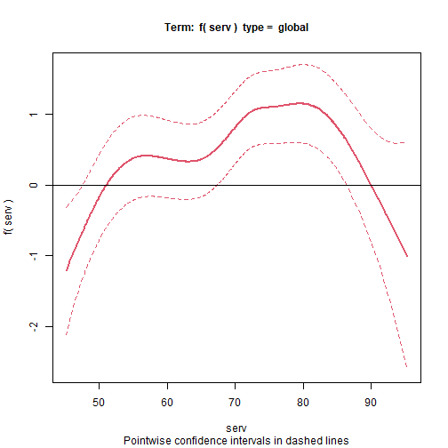
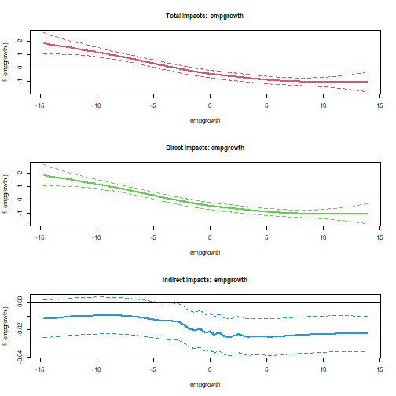
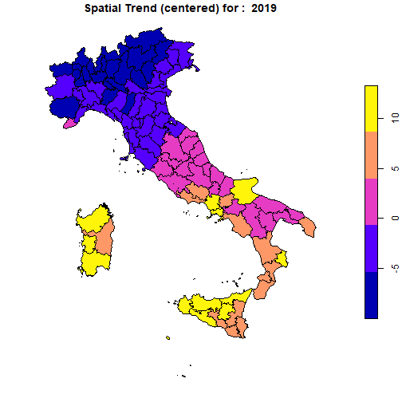
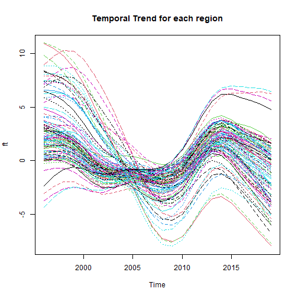

```r
library(pspatreg)
library(spatialreg)
library(spdep)
library(sf)
library(plm)
library(ggplot2)
library(dplyr)
library(splm)
```

# Models for spatial panel data

This section focuses on the semiparametric P-Spline model for spatial panel data. The model may include a smooth spatio-temporal trend, a spatial lag of dependent and independent variables, a time lag of the dependent variable and of its spatial lag, and a time series autoregressive noise. Specifically, we consider a spatio-temporal ANOVA model, disaggregating the trend into spatial and temporal main effects, as well as second- and third-order interactions between them.

The empirical illustration is based on data on regional unemployment in Italy. This example shows that this model represents a valid alternative to parametric methods aimed at disentangling strong and weak cross-sectional dependence when both spatial and temporal heterogeneity are smoothly distributed [see @minguez2020alternative]. The section is organized as follows:

-   Description of dataset, spatial weights matrix and model specifications;

-   Estimation results of linear spatial models and comparison with the results obtained with **splm**;

-   Estimation results of semiparametric spatial models.

## Dataset, spatial weights matrix and model specifications

The package provides the panel data `unemp_it` (an object of class `data.frame`) and the spatial weights matrix `Wsp_it` (a 103 by 103 square matrix). The raw data - a balanced panel with 103 Italian provinces observed for each year between 1996 and 2019 -  can be transformed in a spatial polygonal dataset of class `sf` after having joined the `data.frame` object with the shapefile of Italian provinces:


```r
data(unemp_it, package = "pspatreg")
unemp_it_sf <- st_as_sf(dplyr::left_join(unemp_it, map_it, by = c("prov" = "COD_PRO")))
```

The matrix `Wsp_it` is a standardized inverse distance W matrix. Using `spdep` we transform it in a list of neighbors object:


```r
lwsp_it <- spdep::mat2listw(Wsp_it)
summary(lwsp_it)
```

```
## Characteristics of weights list object:
## Neighbour list object:
## Number of regions: 103 
## Number of nonzero links: 434 
## Percentage nonzero weights: 4.090866 
## Average number of links: 4.213592 
## Link number distribution:
## 
##  1  2  3  4  5  6  7  8  9 
##  7 20 15 16 17 11 10  6  1 
## 7 least connected regions:
## 32 75 78 80 81 90 92 with 1 link
## 1 most connected region:
## 15 with 9 links
## 
## Weights style: M 
## Weights constants summary:
##     n    nn  S0       S1       S2
## M 103 10609 103 74.35526 431.5459
```

## Linear model (comparison with **splm**)

Using these data, we first estimate fully parametric spatial linear autoregressive panel models using the function `pspatfit()` included in the package **pspatreg** (in the default based on the REML estimator) and compare them with the results obtained using the functions provided by the package **splm** (based on the ML estimator).

### Spatial Lag model (SAR). REML estimates using `pspatfit()`

We consider here a fixed effects specification, including both fixed spatial and time effects:

$$y_{it}=\rho \sum_{j=1}^N w_{ij,N} y_{jt} + \sum_{k=1}^K \beta_k x_{k,it}+ \alpha_i+\theta_t+\epsilon_{it}$$

$$\epsilon_{it} \sim i.i.d.(0,\sigma^2_\epsilon)$$


```r
formlin <- unrate ~ empgrowth + partrate + agri + cons + serv

Linear_WITHIN_sar_REML <- pspatfit(formula = formlin,
                   data = unemp_it, 
                   listw = lwsp_it, 
                   demean = TRUE,
                   eff_demean = "twoways",
                   type = "sar",
                   index = c("prov", "year"))

summary(Linear_WITHIN_sar_REML)
```

```
## 
##  Call 
## pspatfit(formula = formlin, data = unemp_it, listw = lwsp_it, 
##     type = "sar", demean = TRUE, eff_demean = "twoways", index = c("prov", 
##         "year"))
## 
##  Parametric Terms 
##             Estimate Std. Error t value  Pr(>|t|)    
## empgrowth -0.129538   0.014091 -9.1932 < 2.2e-16 ***
## partrate   0.391656   0.023315 16.7981 < 2.2e-16 ***
## agri      -0.036743   0.027267 -1.3475 0.1779308    
## cons      -0.166868   0.044510 -3.7490 0.0001816 ***
## serv       0.012198   0.020597  0.5922 0.5537490    
## rho        0.265671   0.018858 14.0880 < 2.2e-16 ***
## ---
## Signif. codes:  0 '***' 0.001 '**' 0.01 '*' 0.05 '.' 0.1 ' ' 1
## 
##  Goodness-of-Fit 
##  
##  EDF Total:      6 
##  Sigma: 1.86934 
##  AIC:  5396.53 
##  BIC:  5431.41
```

```r
Linear_WITHIN_sar_ML <- spml(formlin,
               data = unemp_it, 
               index=c("prov","year"),
               listw = lwsp_it,
               model="within",
               effect = "twoways",
               spatial.error="none", 
               lag=TRUE, 
               Hess = FALSE)

round(data.frame(Linear_WITHIN_sar_REML = c(Linear_WITHIN_sar_REML$rho, 
                                            Linear_WITHIN_sar_REML$bfixed), 
                Linear_WITHIN_sar_ML = c(Linear_WITHIN_sar_ML$coefficients[1], 
                                         Linear_WITHIN_sar_ML$coefficients[-1])),3)
```

```
##                 Linear_WITHIN_sar_REML Linear_WITHIN_sar_ML
## rho                              0.266                0.266
## fixed_empgrowth                 -0.130               -0.130
## fixed_partrate                   0.392                0.392
## fixed_agri                      -0.037               -0.037
## fixed_cons                      -0.167               -0.167
## fixed_serv                       0.012                0.012
```
Clearly, both methods give exactly the same results, at least at the third digit level.

Extract coefficients:


```r
coef(Linear_WITHIN_sar_REML)
```

```
##        rho  empgrowth   partrate       agri       cons       serv 
##  0.2656708 -0.1295384  0.3916562 -0.0367427 -0.1668684  0.0121982
```

Extract fitted values and residuals:


```r
fits <- fitted(Linear_WITHIN_sar_REML)
resids <- residuals(Linear_WITHIN_sar_REML)
```

Extract log-likelihood and restricted log-likelihhod:


```r
logLik(Linear_WITHIN_sar_REML)
```

```
## 'log Lik.' -2692.266 (df=6)
```

```r
logLik(Linear_WITHIN_sar_REML, REML = TRUE)
```

```
## 'log Lik.' -2711.112 (df=6)
```

Extract the covariance matrix of estimated coefficients. Argument `bayesian` allows to get bayesian (default) or frequentist covariances:


```r
vcov(Linear_WITHIN_sar_REML)
```

```
##               empgrowth      partrate          agri          cons          serv
## empgrowth  1.985464e-04 -8.106848e-05 -3.050359e-06  3.032827e-05 -6.861998e-06
## partrate  -8.106848e-05  5.436097e-04 -7.233434e-05 -1.649890e-04 -7.891185e-05
## agri      -3.050359e-06 -7.233434e-05  7.434641e-04  1.891487e-04  2.741340e-04
## cons       3.032827e-05 -1.649890e-04  1.891487e-04  1.981149e-03  2.432964e-04
## serv      -6.861998e-06 -7.891185e-05  2.741340e-04  2.432964e-04  4.242353e-04
```

```r
vcov(Linear_WITHIN_sar_REML, bayesian = FALSE)
```

```
##               empgrowth      partrate          agri          cons          serv
## empgrowth  1.985464e-04 -8.106848e-05 -3.050359e-06  3.032827e-05 -6.861998e-06
## partrate  -8.106848e-05  5.436097e-04 -7.233434e-05 -1.649890e-04 -7.891185e-05
## agri      -3.050359e-06 -7.233434e-05  7.434641e-04  1.891487e-04  2.741340e-04
## cons       3.032827e-05 -1.649890e-04  1.891487e-04  1.981149e-03  2.432964e-04
## serv      -6.861998e-06 -7.891185e-05  2.741340e-04  2.432964e-04  4.242353e-04
```

A print method to get printed coefficients, standard errors and p-values of parametric terms:


```r
print(Linear_WITHIN_sar_REML)
```

```
##           Estimate Std. Error t value Pr(>|t|)
## empgrowth  -0.1295     0.0141 -9.1932   0.0000
## partrate    0.3917     0.0233 16.7981   0.0000
## agri       -0.0367     0.0273 -1.3475   0.1779
## cons       -0.1669     0.0445 -3.7490   0.0002
## serv        0.0122     0.0206  0.5922   0.5537
## rho         0.2657     0.0189 14.0880   0.0000
```

```r
summary(Linear_WITHIN_sar_REML)
```

```
## 
##  Call 
## pspatfit(formula = formlin, data = unemp_it, listw = lwsp_it, 
##     type = "sar", demean = TRUE, eff_demean = "twoways", index = c("prov", 
##         "year"))
## 
##  Parametric Terms 
##             Estimate Std. Error t value  Pr(>|t|)    
## empgrowth -0.129538   0.014091 -9.1932 < 2.2e-16 ***
## partrate   0.391656   0.023315 16.7981 < 2.2e-16 ***
## agri      -0.036743   0.027267 -1.3475 0.1779308    
## cons      -0.166868   0.044510 -3.7490 0.0001816 ***
## serv       0.012198   0.020597  0.5922 0.5537490    
## rho        0.265671   0.018858 14.0880 < 2.2e-16 ***
## ---
## Signif. codes:  0 '***' 0.001 '**' 0.01 '*' 0.05 '.' 0.1 ' ' 1
## 
##  Goodness-of-Fit 
##  
##  EDF Total:      6 
##  Sigma: 1.86934 
##  AIC:  5396.53 
##  BIC:  5431.41
```

```r
summary(Linear_WITHIN_sar_ML)
```

```
## Spatial panel fixed effects lag model
##  
## 
## Call:
## spml(formula = formlin, data = unemp_it, index = c("prov", "year"), 
##     listw = lwsp_it, model = "within", effect = "twoways", lag = TRUE, 
##     spatial.error = "none", Hess = FALSE)
## 
## Residuals:
##      Min.   1st Qu.    Median   3rd Qu.      Max. 
## -8.045700 -1.068404 -0.035768  1.014227  7.816307 
## 
## Spatial autoregressive coefficient:
##        Estimate Std. Error t-value  Pr(>|t|)    
## lambda 0.266004   0.020636   12.89 < 2.2e-16 ***
## 
## Coefficients:
##            Estimate Std. Error t-value  Pr(>|t|)    
## empgrowth -0.129530   0.014078 -9.2009 < 2.2e-16 ***
## partrate   0.391597   0.023464 16.6894 < 2.2e-16 ***
## agri      -0.036771   0.027219 -1.3510 0.1767102    
## cons      -0.166896   0.044420 -3.7572 0.0001718 ***
## serv       0.012191   0.020559  0.5930 0.5532105    
## ---
## Signif. codes:  0 '***' 0.001 '**' 0.01 '*' 0.05 '.' 0.1 ' ' 1
```
Computing average direct, indirect and total marginal impacts:


```r
imp_parvar_sar <- impactspar(Linear_WITHIN_sar_REML, listw = lwsp_it)
summary(imp_parvar_sar)
```

```
## 
##  Total Parametric Impacts (sar) 
##            Estimate Std. Error   t value Pr(>|t|)
## empgrowth -0.176573   0.019656 -8.983384   0.0000
## partrate   0.534058   0.034073 15.674062   0.0000
## agri      -0.050685   0.038156 -1.328366   0.1841
## cons      -0.230225   0.061790 -3.725926   0.0002
## serv       0.017306   0.028278  0.611988   0.5405
## 
##  Direct Parametric Impacts (sar) 
##            Estimate Std. Error   t value Pr(>|t|)
## empgrowth -0.132763   0.014486 -9.164996   0.0000
## partrate   0.401542   0.023991 16.737464   0.0000
## agri      -0.038115   0.028685 -1.328747   0.1839
## cons      -0.173082   0.046139 -3.751332   0.0002
## serv       0.012996   0.021247  0.611659   0.5408
## 
##  Indirect Parametric Impacts (sar) 
##             Estimate Std. Error    t value Pr(>|t|)
## empgrowth -0.0438106  0.0061748 -7.0950827   0.0000
## partrate   0.1325152  0.0142666  9.2884688   0.0000
## agri      -0.0125704  0.0095534 -1.3158057   0.1882
## cons      -0.0571431  0.0163081 -3.5039727   0.0005
## serv       0.0043098  0.0070594  0.6105034   0.5415
```


### Spatial error within model (SEM). REML estimates using `pspatfit()`:

$$y_{it}= \sum_{k=1}^K \beta_k x_{k,it}+\alpha_i+\theta_t+ \epsilon_{it}$$

$$\epsilon_{it}=\theta \sum_{j=1}^N w_{ij,N}\epsilon_{it}+u_{it}$$

$$u_{it} \sim i.i.d.(0,\sigma^2_u)$$


```r
Linear_WITHIN_sem_REML <- pspatfit(formlin,
                               data = unemp_it, 
                               demean = TRUE,
                               eff_demean = "twoways",
                               listw = lwsp_it, 
                               index = c("prov", "year"),
                               type = "sem")

Linear_WITHIN_sem_ML <- spml(formlin,
                         data = unemp_it, 
                         index=c("prov","year"),
                         listw = lwsp_it,
                         model="within",
                         effect = "twoways",
                         spatial.error="b", 
                         lag=FALSE, 
                         Hess = FALSE)

round(data.frame(Linear_WITHIN_sem_REML = c(Linear_WITHIN_sem_REML$delta, 
                                            Linear_WITHIN_sem_REML$bfixed), 
                 Linear_WITHIN_sem_ML = c(Linear_WITHIN_sem_ML$spat.coef, 
                                          Linear_WITHIN_sem_ML$coefficients[-1])),3)
```

```
##                 Linear_WITHIN_sem_REML Linear_WITHIN_sem_ML
## delta                            0.283                0.283
## fixed_empgrowth                 -0.134               -0.134
## fixed_partrate                   0.399                0.399
## fixed_agri                      -0.033               -0.033
## fixed_cons                      -0.188               -0.188
## fixed_serv                       0.031                0.031
```


## Semiparametric model without spatial trends

Now, we estimate an additive semiparametric model with three parametric linear terms (for `partrate`, `agri`, and `cons`) and two nonparametric smooth terms (for `serv` and `empgrowth`), but without including any control for spatial and temporal autocorrelation and for the spatio-temporal heterogeneity: $$y_{it}= \sum_{k=1}^K \beta_k z_{k,it} + \sum_{\delta=1}^{\Delta} g_\delta(x_{\delta_{it}}) + \epsilon_{it}$$

$$\epsilon_{it} \sim i.i.d.(0,\sigma^2_\epsilon)$$


```r
formgam <- unrate ~ partrate + agri + cons +
                  pspl(serv, nknots = 15) + 
                  pspl(empgrowth, nknots = 20)

gam <- pspatfit(formgam, data = unemp_it)
summary(gam)
```

```
## 
##  Call 
## pspatfit(formula = formgam, data = unemp_it)
## 
##  Parametric Terms 
##                                  Estimate Std. Error  t value  Pr(>|t|)    
## (Intercept)                    25.838300   1.188444  21.7413 < 2.2e-16 ***
## partrate                       -0.376000   0.018302 -20.5441 < 2.2e-16 ***
## agri                            0.346431   0.020116  17.2215 < 2.2e-16 ***
## cons                           -0.182950   0.055461  -3.2987 0.0009852 ***
## pspl(serv, nknots = 15).1      17.178586   2.682465   6.4040 1.807e-10 ***
## pspl(empgrowth, nknots = 20).1  7.100932   2.766358   2.5669 0.0103203 *  
## ---
## Signif. codes:  0 '***' 0.001 '**' 0.01 '*' 0.05 '.' 0.1 ' ' 1
## 
##  Non-Parametric Terms 
##                                  EDF
## pspl(serv, nknots = 15)      5.0572
## pspl(empgrowth, nknots = 20) 4.0149
## 
##  Goodness-of-Fit 
##  
##  EDF Total: 15.0721 
##  Sigma: 4.07535 
##  AIC:  9467.19 
##  BIC:  9554.8
```

The same model, but with a spatial autoregressive term (SAR): $$y_{it}= \rho \sum_{j=1}^N w_{ij,N} y_{jt} +\sum_{k=1}^K \beta_k z_{k,it} + \sum_{\delta=1}^{\Delta} g_\delta(x_{\delta_{it}}) + \epsilon_{it}$$

$$\epsilon_{it} \sim i.i.d.(0,\sigma^2_\epsilon)$$


```r
gamsar <- pspatfit(formgam, data = unemp_it, listw = lwsp_it, method = "eigen", type = "sar")
summary(gamsar)
```

```
## 
##  Call 
## pspatfit(formula = formgam, data = unemp_it, listw = lwsp_it, 
##     type = "sar", method = "eigen")
## 
##  Parametric Terms 
##                                  Estimate Std. Error  t value  Pr(>|t|)    
## (Intercept)                    10.365069   0.749445  13.8303 < 2.2e-16 ***
## partrate                       -0.162496   0.011712 -13.8740 < 2.2e-16 ***
## agri                            0.094202   0.013111   7.1848 8.883e-13 ***
## cons                           -0.094705   0.036083  -2.6246  0.008728 ** 
## pspl(serv, nknots = 15).1       5.035216   2.011297   2.5035  0.012363 *  
## pspl(empgrowth, nknots = 20).1  3.451821   0.875655   3.9420 8.307e-05 ***
## rho                             0.658983   0.011264  58.5028 < 2.2e-16 ***
## ---
## Signif. codes:  0 '***' 0.001 '**' 0.01 '*' 0.05 '.' 0.1 ' ' 1
## 
##  Non-Parametric Terms 
##                                  EDF
## pspl(serv, nknots = 15)      6.1815
## pspl(empgrowth, nknots = 20) 0.3015
## 
##  Goodness-of-Fit 
##  
##  EDF Total: 13.483 
##  Sigma: 3.56041 
##  AIC:  7762.85 
##  BIC:  7841.22
```

and a spatial error term: $$y_{it}= \sum_{k=1}^K \beta_k z_{k,it} + \sum_{\delta=1}^{\Delta} g_\delta(x_{\delta_{it}}) + \epsilon_{it}$$

$$\epsilon_{it} = \delta \sum_{j=1}^N w_{ij,N}\epsilon_{it}+u_{it}$$

$$u_{it} \sim i.i.d.(0,\sigma^2_u)$$


```r
gamsem <- pspatfit(formgam, data = unemp_it, listw = lwsp_it, method = "eigen", type = "sem")
```

```
## Error in solve(H) : 
##   Lapack dgecon(): system computationally singular, reciprocal condition number = 2.00943e-32
## Error in solve(H) : 
##   Lapack dgecon(): system computationally singular, reciprocal condition number = 3.79993e-33
## Error in solve(H) : 
##   Lapack dgecon(): system computationally singular, reciprocal condition number = 3.56974e-33
```

```r
summary(gamsem)
```

```
## 
##  Call 
## pspatfit(formula = formgam, data = unemp_it, listw = lwsp_it, 
##     type = "sem", method = "eigen")
## 
##  Parametric Terms 
##                                  Estimate Std. Error  t value  Pr(>|t|)    
## (Intercept)                    19.750896   1.093575  18.0609 < 2.2e-16 ***
## partrate                       -0.218101   0.020990 -10.3908 < 2.2e-16 ***
## agri                            0.020851   0.015059   1.3846  0.166289    
## cons                           -0.088517   0.039019  -2.2686  0.023381 *  
## pspl(serv, nknots = 15).1       5.069505   2.809307   1.8045  0.071269 .  
## pspl(empgrowth, nknots = 20).1  2.242396   0.864930   2.5926  0.009583 ** 
## delta                           0.751108   0.011003  68.2629 < 2.2e-16 ***
## ---
## Signif. codes:  0 '***' 0.001 '**' 0.01 '*' 0.05 '.' 0.1 ' ' 1
## 
##  Non-Parametric Terms 
##                                  EDF
## pspl(serv, nknots = 15)      9.8505
## pspl(empgrowth, nknots = 20) 0.0001
## 
##  Goodness-of-Fit 
##  
##  EDF Total: 16.8506 
##  Sigma: 4.85658 
##  AIC:  8083.08 
##  BIC:  8181.03
```

We can control for spatio-temporal heterogeneity by including a PS-ANOVA spatial trend in 3d. The interaction terms (`f12`,`f1t`,`f2t` and `f12t`) with nested basis. Remark: `nest_sp1`, `nest_sp2` and `nest_time` must be divisors of `nknots`.

$$y_{it}= \sum_{k=1}^K \beta_k z_{k,it} + \sum_{\delta=1}^{\Delta} g_\delta(x_{\delta_{it}}) + 
f_1(s_{1i})+f_2(s_{2i})+f_{\tau}(\tau_t)+ \\ f_{1,2}(s_{1i},s_{2i})+f_{1,\tau}(s_{1i},\tau_t)+f_{2,\tau}+(s_{2i},\tau_t)+f_{1,2,\tau}(s_{1i},s_{2i},\tau_t)+\epsilon_{it}$$

$$\epsilon_{it} \sim i.i.d.(0,\sigma^2_\epsilon)$$


```r
form3d_psanova <- unrate ~ partrate + agri + cons +
                  pspl(serv, nknots = 15) + 
                  pspl(empgrowth, nknots = 20) +
                  pspt(long, lat, year, 
                       nknots = c(18,18,8), psanova = TRUE, 
                       nest_sp1 = c(1, 2, 3), 
                       nest_sp2 = c(1, 2, 3),
                       nest_time = c(1, 2, 2))

sp3danova <- pspatfit(form3d_psanova, data = unemp_it,
                    listw = lwsp_it, method = "Chebyshev")  

summary(sp3danova)
```

```
## 
##  Call 
## pspatfit(formula = form3d_psanova, data = unemp_it, listw = lwsp_it, 
##     method = "Chebyshev")
## 
##  Parametric Terms 
##                                   Estimate Std. Error t value  Pr(>|t|)    
## (Intercept)                      4.095250   8.439029  0.4853    0.6275    
## partrate                         0.149554   0.021941  6.8162 1.194e-11 ***
## agri                            -0.020493   0.019754 -1.0374    0.2997    
## cons                            -0.038577   0.040441 -0.9539    0.3402    
## f1_main.1                       -1.784476  13.258650 -0.1346    0.8929    
## f2_main.1                      -15.501067  10.962662 -1.4140    0.1575    
## ft_main.1                        2.417563   4.896167  0.4938    0.6215    
## f12_int.1                       -8.775366  12.354467 -0.7103    0.4776    
## f1t_int.1                        4.128181   6.471923  0.6379    0.5236    
## f2t_int.1                       -2.087737   6.777911 -0.3080    0.7581    
## f12t_int.1                       1.433789   7.658633  0.1872    0.8515    
## pspl(serv, nknots = 15).1        0.730598   1.607166  0.4546    0.6494    
## pspl(empgrowth, nknots = 20).1   4.515110   1.027497  4.3943 1.163e-05 ***
## ---
## Signif. codes:  0 '***' 0.001 '**' 0.01 '*' 0.05 '.' 0.1 ' ' 1
## 
##  Non-Parametric Terms 
##                                  EDF
## pspl(serv, nknots = 15)      5.5662
## pspl(empgrowth, nknots = 20) 2.6235
## 
##  Non-Parametric Spatio-Temporal Trend 
##         EDF
## f1   10.664
## f2    9.732
## ft    7.782
## f12  45.426
## f1t   4.241
## f2t  21.454
## f12t 82.117
## 
##  Goodness-of-Fit 
##  
##  EDF Total: 202.607 
##  Sigma: 1.54011 
##  AIC:  5975.9 
##  BIC:  7153.61
```

A semiparametric model with a PS-ANOVA spatial trend in 3d with the exclusion of some ANOVA components


```r
form3d_psanova_restr <- unrate ~ partrate + agri + cons +
                        pspl(serv, nknots = 15) + 
                        pspl(empgrowth, nknots = 20) +
                        pspt(long, lat, year, 
                         nknots = c(18,18,8), psanova = TRUE, 
                         nest_sp1 = c(1, 2, 3), 
                         nest_sp2 = c(1, 2, 3),
                         nest_time = c(1, 2, 2),
                         f1t = FALSE, f2t = FALSE)

sp3danova_restr <- pspatfit(form3d_psanova_restr, data = unemp_it,
                    listw = lwsp_it, method = "Chebyshev")  

summary(sp3danova_restr)
```

```
## 
##  Call 
## pspatfit(formula = form3d_psanova_restr, data = unemp_it, listw = lwsp_it, 
##     method = "Chebyshev")
## 
##  Parametric Terms 
##                                   Estimate Std. Error t value  Pr(>|t|)    
## (Intercept)                      4.462162   8.440437  0.5287   0.59709    
## partrate                         0.150991   0.021907  6.8925 7.080e-12 ***
## agri                            -0.027567   0.019677 -1.4010   0.16135    
## cons                            -0.022675   0.040534 -0.5594   0.57594    
## f1_main.1                       -1.240456  13.261361 -0.0935   0.92548    
## f2_main.1                      -15.908898  10.966372 -1.4507   0.14700    
## ft_main.1                        4.177267   1.887587  2.2130   0.02700 *  
## f12_int.1                       -8.204611  12.401659 -0.6616   0.50831    
## f12t_int.1                      14.522959   6.279136  2.3129   0.02082 *  
## pspl(serv, nknots = 15).1        0.483243   1.549567  0.3119   0.75518    
## pspl(empgrowth, nknots = 20).1   4.671660   1.026827  4.5496 5.658e-06 ***
## ---
## Signif. codes:  0 '***' 0.001 '**' 0.01 '*' 0.05 '.' 0.1 ' ' 1
## 
##  Non-Parametric Terms 
##                                  EDF
## pspl(serv, nknots = 15)      5.3124
## pspl(empgrowth, nknots = 20) 2.6184
## 
##  Non-Parametric Spatio-Temporal Trend 
##          EDF
## f1    10.589
## f2     9.663
## ft     7.765
## f12   45.582
## f1t    0.000
## f2t    0.000
## f12t 114.194
## 
##  Goodness-of-Fit 
##  
##  EDF Total: 206.724 
##  Sigma: 1.54107 
##  AIC:  6019.37 
##  BIC:  7221.01
```

Now we add a spatial lag (*sar*) and temporal correlation in the noise of PSANOVA 3d model.

$$y_{it}= \rho \sum_{j=1}^N w_{ij,N} y_{jt}+\sum_{k=1}^K \beta_k z_{k,it} + \sum_{\delta=1}^{\Delta} g_\delta(x_{\delta_{it}}) + 
f_1(s_{1i})+f_2(s_{2i})+f_{\tau}(\tau_t)+ \\ f_{1,2}(s_{1i},s_{2i})+f_{1,\tau}(s_{1i},\tau_t)+f_{2,\tau}+(s_{2i},\tau_t)+f_{1,2,\tau}(s_{1i},s_{2i},\tau_t)+\epsilon_{it}$$

$$\epsilon_{it} \sim i.i.d.(0,\sigma^2_\epsilon)$$


```r
sp3danovasarar1 <- pspatfit(form3d_psanova_restr, data = unemp_it, 
                              listw = lwsp_it, method = "Chebyshev", 
                              type = "sar", cor = "ar1")  
summary(sp3danovasarar1)
```

```
## 
##  Call 
## pspatfit(formula = form3d_psanova_restr, data = unemp_it, listw = lwsp_it, 
##     type = "sar", method = "Chebyshev", cor = "ar1")
## 
##  Parametric Terms 
##                                    Estimate  Std. Error t value  Pr(>|t|)    
## (Intercept)                      4.4102526   7.9405349  0.5554   0.57867    
## partrate                         0.1464218   0.0211985  6.9072 6.389e-12 ***
## agri                            -0.0358110   0.0218811 -1.6366   0.10185    
## cons                            -0.0088702   0.0425165 -0.2086   0.83476    
## f1_main.1                       -0.2450048  12.3986588 -0.0198   0.98424    
## f2_main.1                      -13.2751193  10.1719792 -1.3051   0.19200    
## ft_main.1                        3.1757687   1.6375755  1.9393   0.05259 .  
## f12_int.1                       -7.0317520  11.4496509 -0.6141   0.53918    
## f12t_int.1                      10.8990908   5.4265178  2.0085   0.04471 *  
## pspl(serv, nknots = 15).1        0.7822449   1.6126291  0.4851   0.62767    
## pspl(empgrowth, nknots = 20).1   4.8928705   0.8550451  5.7224 1.189e-08 ***
## rho                              0.0472547   0.0217937  2.1683   0.03024 *  
## phi                              0.3154952   0.0138261 22.8188 < 2.2e-16 ***
## ---
## Signif. codes:  0 '***' 0.001 '**' 0.01 '*' 0.05 '.' 0.1 ' ' 1
## 
##  Non-Parametric Terms 
##                                  EDF
## pspl(serv, nknots = 15)      4.6292
## pspl(empgrowth, nknots = 20) 2.7262
## 
##  Non-Parametric Spatio-Temporal Trend 
##          EDF
## f1    10.017
## f2     9.512
## ft     7.863
## f12   43.323
## f1t    0.000
## f2t    0.000
## f12t 102.168
## 
##  Goodness-of-Fit 
##  
##  EDF Total: 192.238 
##  Sigma: 2.56494 
##  AIC:  5555.63 
##  BIC:  6673.07
```

Examples of LR test:


```r
anova(gam, gamsar, lrtest = TRUE)
```

```
##         logLik rlogLik    edf    AIC    BIC LRtest p.val
## gam    -4718.5 -4728.2 15.072 9467.2 9574.0             
## gamsar -3867.9 -3881.1 13.483 7762.8 7867.4 1694.2   NaN
```

```r
anova(gam, gamsar, lrtest = TRUE)
```

```
##         logLik rlogLik    edf    AIC    BIC LRtest p.val
## gam    -4718.5 -4728.2 15.072 9467.2 9574.0             
## gamsar -3867.9 -3881.1 13.483 7762.8 7867.4 1694.2   NaN
```

```r
anova(gamsar, gamsem, lrtest = FALSE)
```

```
##         logLik rlogLik    edf    AIC    BIC
## gamsar -3867.9 -3881.1 13.483 7762.8 7867.4
## gamsem -4024.7 -4036.0 16.851 8083.1 8203.6
```

```r
anova(gam, sp3danova_restr, lrtest = TRUE)
```

```
##                  logLik rlogLik     edf    AIC    BIC LRtest p.val
## gam             -4718.5 -4728.2  15.072 9467.2 9574.0             
## sp3danova_restr -2803.0 -2802.9 206.724 6019.4 7202.8 3850.6     0
```

```r
anova(sp3danova_restr, sp3danovasarar1, lrtest = FALSE)
```

```
##                  logLik rlogLik    edf    AIC    BIC
## sp3danova_restr -2803.0 -2802.9 206.72 6019.4 7202.8
## sp3danovasarar1 -2585.6 -2586.1 192.24 5555.6 6658.6
```

Plot of non-parametric terms


```r
list_varnopar <- c("serv", "empgrowth")
terms_nopar <- fit_terms(sp3danova_restr, list_varnopar)
names(terms_nopar)
```

```
## [1] "fitted_terms"           "se_fitted_terms"        "fitted_terms_fixed"    
## [4] "se_fitted_terms_fixed"  "fitted_terms_random"    "se_fitted_terms_random"
```

```r
plot_terms(terms_nopar, unemp_it, alpha = 0.05)
```




### Parametric and nonparametric direct, indirect and total impacts


```r
imp_nparvar <- impactspar(sp3danovasarar1, listw = lwsp_it)
summary(imp_nparvar)
```

```
## 
##  Total Parametric Impacts (sar) 
##           Estimate Std. Error   t value Pr(>|t|)
## partrate  0.153142   0.022658  6.758868   0.0000
## agri     -0.037896   0.022871 -1.656943   0.0975
## cons     -0.012391   0.044590 -0.277893   0.7811
## 
##  Direct Parametric Impacts (sar) 
##           Estimate Std. Error   t value Pr(>|t|)
## partrate  0.146027   0.021483  6.797458   0.0000
## agri     -0.036156   0.021841 -1.655381   0.0978
## cons     -0.011843   0.042540 -0.278394   0.7807
## 
##  Indirect Parametric Impacts (sar) 
##             Estimate  Std. Error     t value Pr(>|t|)
## partrate  0.00711462  0.00358871  1.98250003   0.0474
## agri     -0.00174043  0.00140364 -1.23994188   0.2150
## cons     -0.00054843  0.00227842 -0.24070396   0.8098
```


```r
imp_nparvar <- impactsnopar(sp3danovasarar1, listw = lwsp_it, viewplot = TRUE)
```




### Spatial trend 3d (ANOVA).

Plot of spatial trends in 1996, 2005 and 2019


```r
plot_sp3d(sp3danovasarar1, data = unemp_it_sf, 
          time_var = "year", time_index = c(1996, 2005, 2019),
          addmain = FALSE, addint = FALSE)
```




Plot of spatio-temporal trend, main effects and interaction effect for a year:


```r
plot_sp3d(sp3danovasarar1, data = unemp_it_sf, 
          time_var = "year", time_index = c(2019),
          addmain = TRUE, addint = TRUE)
```


Plot of temporal trend for each province:


```r
plot_sptime(sp3danovasarar1, data = unemp_it, 
            time_var = "year", reg_var = "prov")
```



Plots of *fitted* and *residuals* of the last model:


```r
fits <- fitted(sp3danovasarar1)
resids <- residuals(sp3danovasarar1)
plot(fits, unemp_it$unrate)
```


```r
plot(fits, resids)
```


# References
