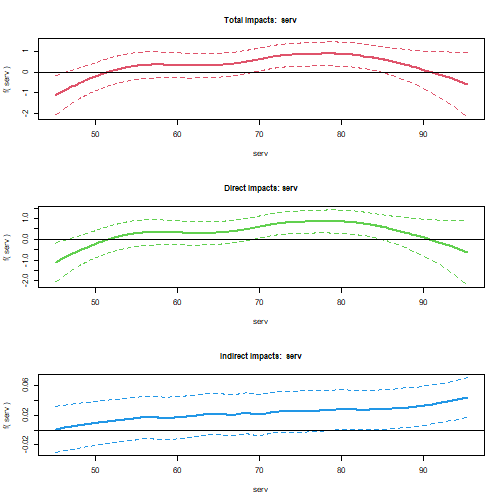
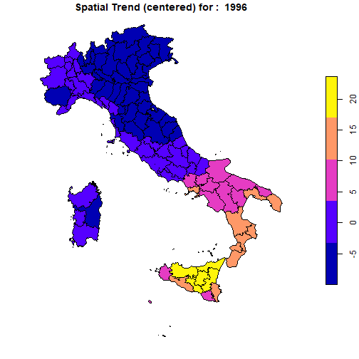

```r
library(spatialreg)
library(spdep)
library(sf)
library(plm)
library(ggplot2)
library(dplyr)
library(splm)
```

# Models for spatial panel data

This section focuses on the semiparametric P-Spline model for spatial panel data. The model may include a smooth spatio-temporal trend, a spatial lag of dependent and independent variables, a time lag of the dependent variable and of its spatial lag, and a time series autoregressive noise. Specifically, we consider a spatio-temporal ANOVA model, disaggregating the trend into spatial and temporal main effects, as well as second- and third-order interactions between them.

The empirical illustration is based on data on regional unemployment in Italy. This example shows that this model represents a valid alternative to parametric methods aimed at disentangling strong and weak cross-sectional dependence when both spatial and temporal heterogeneity are smoothly distributed \citep[see][]{minguez2020alternative}. The section is organized as follows:

-   Description of dataset, spatial weights matrix and model specifications;

-   Estimation results of linear spatial models and comparison with the results obtained with `splm`;

-   Estimation results of semiparametric spatial models.

## Dataset, spatial weights matrix and model specifications

The packageprovides the panel data `unemp_it` (an object of class `data.frame`) and the spatial weights matrix `Wsp_it` (a 103 by 103 square matrix). The raw data - a balanced panel with 103 Italian provinces observed for each year between 1996 and 2019 -  can be transformed in a spatial polygonal dataset of class `sf` after having joined the `data.frame` object with the shapefile of Italian provinces:


```r
data(unemp_it, package = "pspatreg")
unemp_it_sf <- st_as_sf(dplyr::left_join(unemp_it, map_it, by = c("prov" = "COD_PRO")))
```

The matrix `Wsp_it` is a standardized inverse distance W matrix. Using `spdep` we transform it in a list of neighbors object:


```r
lwsp_it <- spdep::mat2listw(Wsp_it)
summary(lwsp_it)
```

```
## Characteristics of weights list object:
## Neighbour list object:
## Number of regions: 103 
## Number of nonzero links: 434 
## Percentage nonzero weights: 4.090866 
## Average number of links: 4.213592 
## Link number distribution:
## 
##  1  2  3  4  5  6  7  8  9 
##  7 20 15 16 17 11 10  6  1 
## 7 least connected regions:
## 32 75 78 80 81 90 92 with 1 link
## 1 most connected region:
## 15 with 9 links
## 
## Weights style: M 
## Weights constants summary:
##     n    nn  S0       S1       S2
## M 103 10609 103 74.35526 431.5459
```

## Linear model (comparison with `splm`)

Using these data, we first estimate fully parametric spatial linear autoregressive panel models using the function `pspatfit()` included in the package `pspatreg` (based on the REML estimator) and compare them with the results obtained using the functions provided by the package `splm` (based on the ML estimator).

### Spatial Lag model (SAR). REML estimates using `pspatfit()`

We consider here a fixed effects specification, including both fixed spatial and time effects:

$$y_{it}=\rho \sum_{j=1}^N w_{ij,N} y_{jt} + \sum_{k=1}^K \beta_k x_{k,it}+ \alpha_i+\theta_t+\epsilon_{it}$$

$$\epsilon_{it} \sim i.i.d.(0,\sigma^2_\epsilon)$$


```r
formlin <- unrate ~ empgrowth + partrate + agri + cons + serv

Linear_WITHIN_sar_REML <- pspatfit(formula = formlin,
                   data = unemp_it, 
                   listw = lwsp_it, 
                   demean = TRUE,
                   eff_demean = "twoways",
                   type = "sar",
                   index = c("prov", "year"))

summary(Linear_WITHIN_sar_REML)
```

```
## 
##  Call 
## pspatfit(formula = formlin, data = unemp_it, listw = lwsp_it, 
##     type = "sar", demean = TRUE, eff_demean = "twoways", index = c("prov", 
##         "year"))
## 
##  Parametric Terms 
##             Estimate Std. Error t value  Pr(>|t|)    
## empgrowth -0.129538   0.014080 -9.2004 < 2.2e-16 ***
## partrate   0.391656   0.023297 16.8112 < 2.2e-16 ***
## agri      -0.036743   0.027245 -1.3486 0.1775934    
## cons      -0.166868   0.044475 -3.7519 0.0001795 ***
## serv       0.012198   0.020581  0.5927 0.5534403    
## rho        0.265799   0.018848 14.1023 < 2.2e-16 ***
## ---
## Signif. codes:  0 '***' 0.001 '**' 0.01 '*' 0.05 '.' 0.1 ' ' 1
## 
##  Goodness-of-Fit 
##  
##  EDF Total:      6 
##  Sigma: 1.86934 
##  AIC:  5396.52 
##  BIC:  5431.4
```

```r
Linear_WITHIN_sar_ML <- spml(formlin,
               data = unemp_it, 
               index=c("prov","year"),
               listw = lwsp_it,
               model="within",
               effect = "twoways",
               spatial.error="none", 
               lag=TRUE, 
               Hess = FALSE)

round(data.frame(Linear_WITHIN_sar_REML = c(Linear_WITHIN_sar_REML$rho, Linear_WITHIN_sar_REML$bfixed), Linear_WITHIN_sar_ML = c(Linear_WITHIN_sar_ML$coefficients[1],Linear_WITHIN_sar_ML$coefficients[-1])),3)
```

```
##                 Linear_WITHIN_sar_REML Linear_WITHIN_sar_ML
## rho                              0.266                0.266
## fixed_empgrowth                 -0.130               -0.130
## fixed_partrate                   0.392                0.392
## fixed_agri                      -0.037               -0.037
## fixed_cons                      -0.167               -0.167
## fixed_serv                       0.012                0.012
```
Clearly, both methods give exactly the same results, at least at the third digit level.

Extract coefficients:


```r
coef(Linear_WITHIN_sar_REML)
```

```
##        rho  empgrowth   partrate       agri       cons       serv 
##  0.2657991 -0.1295384  0.3916562 -0.0367427 -0.1668684  0.0121982
```

Extract fitted values and residuals:


```r
fits <- fitted(Linear_WITHIN_sar_REML)
resids <- residuals(Linear_WITHIN_sar_REML)
```

Extract log-likelihood and restricted log-likelihhod:


```r
logLik(Linear_WITHIN_sar_REML)
```

```
## 'log Lik.' -2692.26 (df=6)
```

```r
logLik(Linear_WITHIN_sar_REML, REML = TRUE)
```

```
## 'log Lik.' -2711.11 (df=6)
```

Extract the covariance matrix of estimated coefficients. Argument `bayesian` allows to get frequentist (default) or bayesian covariances:


```r
vcov(Linear_WITHIN_sar_REML)
```

```
##               empgrowth      partrate          agri          cons          serv
## empgrowth  1.982376e-04 -8.094238e-05 -3.045614e-06  0.0000302811 -6.851324e-06
## partrate  -8.094238e-05  5.427641e-04 -7.222182e-05 -0.0001647323 -7.878910e-05
## agri      -3.045614e-06 -7.222182e-05  7.423076e-04  0.0001888545  2.737076e-04
## cons       3.028110e-05 -1.647323e-04  1.888545e-04  0.0019780673  2.429180e-04
## serv      -6.851324e-06 -7.878910e-05  2.737076e-04  0.0002429180  4.235754e-04
```

```r
vcov(Linear_WITHIN_sar_REML, bayesian = TRUE)
```

```
##               empgrowth      partrate          agri          cons          serv
## empgrowth  1.982376e-04 -8.094238e-05 -3.045614e-06  0.0000302811 -6.851324e-06
## partrate  -8.094238e-05  5.427641e-04 -7.222182e-05 -0.0001647323 -7.878910e-05
## agri      -3.045614e-06 -7.222182e-05  7.423076e-04  0.0001888545  2.737076e-04
## cons       3.028110e-05 -1.647323e-04  1.888545e-04  0.0019780673  2.429180e-04
## serv      -6.851324e-06 -7.878910e-05  2.737076e-04  0.0002429180  4.235754e-04
```

A print method to get printed coefficients, standard errors and p-values of parametric terms:


```r
print(Linear_WITHIN_sar_REML)
```

```
##           Estimate Std. Error t value Pr(>|t|)
## empgrowth  -0.1295     0.0141 -9.2004   0.0000
## partrate    0.3917     0.0233 16.8112   0.0000
## agri       -0.0367     0.0272 -1.3486   0.1776
## cons       -0.1669     0.0445 -3.7519   0.0002
## serv        0.0122     0.0206  0.5927   0.5534
## rho         0.2658     0.0188 14.1023   0.0000
```

```r
summary(Linear_WITHIN_sar_REML)
```

```
## 
##  Call 
## pspatfit(formula = formlin, data = unemp_it, listw = lwsp_it, 
##     type = "sar", demean = TRUE, eff_demean = "twoways", index = c("prov", 
##         "year"))
## 
##  Parametric Terms 
##             Estimate Std. Error t value  Pr(>|t|)    
## empgrowth -0.129538   0.014080 -9.2004 < 2.2e-16 ***
## partrate   0.391656   0.023297 16.8112 < 2.2e-16 ***
## agri      -0.036743   0.027245 -1.3486 0.1775934    
## cons      -0.166868   0.044475 -3.7519 0.0001795 ***
## serv       0.012198   0.020581  0.5927 0.5534403    
## rho        0.265799   0.018848 14.1023 < 2.2e-16 ***
## ---
## Signif. codes:  0 '***' 0.001 '**' 0.01 '*' 0.05 '.' 0.1 ' ' 1
## 
##  Goodness-of-Fit 
##  
##  EDF Total:      6 
##  Sigma: 1.86934 
##  AIC:  5396.52 
##  BIC:  5431.4
```

```r
summary(Linear_WITHIN_sar_ML)
```

```
## Spatial panel fixed effects lag model
##  
## 
## Call:
## spml(formula = formlin, data = unemp_it, index = c("prov", "year"), 
##     listw = lwsp_it, model = "within", effect = "twoways", lag = TRUE, 
##     spatial.error = "none", Hess = FALSE)
## 
## Residuals:
##      Min.   1st Qu.    Median   3rd Qu.      Max. 
## -8.045700 -1.068404 -0.035768  1.014227  7.816307 
## 
## Spatial autoregressive coefficient:
##        Estimate Std. Error t-value  Pr(>|t|)    
## lambda 0.266004   0.020636   12.89 < 2.2e-16 ***
## 
## Coefficients:
##            Estimate Std. Error t-value  Pr(>|t|)    
## empgrowth -0.129530   0.014078 -9.2009 < 2.2e-16 ***
## partrate   0.391597   0.023464 16.6894 < 2.2e-16 ***
## agri      -0.036771   0.027219 -1.3510 0.1767102    
## cons      -0.166896   0.044420 -3.7572 0.0001718 ***
## serv       0.012191   0.020559  0.5930 0.5532105    
## ---
## Signif. codes:  0 '***' 0.001 '**' 0.01 '*' 0.05 '.' 0.1 ' ' 1
```
Computing average direct, indirect and total marginal impacts:


```r
imp_parvar_sar <- impactspar(Linear_WITHIN_sar_REML, listw = lwsp_it)
summary(imp_parvar_sar)
```

```
## 
##  Total Parametric Impacts (sar) 
##            Estimate Std. Error   t value Pr(>|t|)
## empgrowth -0.176938   0.019717 -8.973880   0.0000
## partrate   0.534331   0.034560 15.460801   0.0000
## agri      -0.051365   0.036635 -1.402085   0.1609
## cons      -0.229516   0.062053 -3.698690   0.0002
## serv       0.014855   0.027506  0.540067   0.5892
## 
##  Direct Parametric Impacts (sar) 
##            Estimate Std. Error   t value Pr(>|t|)
## empgrowth -0.132909   0.014404 -9.226954   0.0000
## partrate   0.401376   0.023885 16.804777   0.0000
## agri      -0.038597   0.027465 -1.405349   0.1599
## cons      -0.172395   0.046373 -3.717568   0.0002
## serv       0.011141   0.020619  0.540344   0.5890
## 
##  Indirect Parametric Impacts (sar) 
##             Estimate Std. Error    t value Pr(>|t|)
## empgrowth -0.0440285  0.0062805 -7.0103495   0.0000
## partrate   0.1329551  0.0145591  9.1320949   0.0000
## agri      -0.0127681  0.0092499 -1.3803609   0.1675
## cons      -0.0571213  0.0163298 -3.4979871   0.0005
## serv       0.0037140  0.0069122  0.5373167   0.5910
```


### Spatial error within model (SEM). REML estimates using `pspatfit()`:

$$y_{it}= \sum_{k=1}^K \beta_k x_{k,it}+\alpha_i+\theta_t+ \epsilon_{it}$$

$$\epsilon_{it}=\theta \sum_{j=1}^N w_{ij,N}\epsilon_{it}+u_{it}$$

$$u_{it} \sim i.i.d.(0,\sigma^2_u)$$


```r
Linear_WITHIN_sem_REML <- pspatfit(formlin,
                               data = unemp_it, 
                               demean = TRUE,
                               eff_demean = "twoways",
                               listw = lwsp_it, 
                               index = c("prov", "year"),
                               type = "sem")

Linear_WITHIN_sem_ML <- spml(formlin,
                         data = unemp_it, 
                         index=c("prov","year"),
                         listw = lwsp_it,
                         model="within",
                         effect = "twoways",
                         spatial.error="b", 
                         lag=FALSE, 
                         Hess = FALSE)

round(data.frame(Linear_WITHIN_sem_REML = c(Linear_WITHIN_sem_REML$delta, 
                                        Linear_WITHIN_sem_REML$bfixed), 
                 Linear_WITHIN_sem_ML = c(Linear_WITHIN_sem_ML$spat.coef,                           Linear_WITHIN_sem_ML$coefficients[-1])),3)
```

```
##                 Linear_WITHIN_sem_REML Linear_WITHIN_sem_ML
## delta                            0.283                0.283
## fixed_empgrowth                 -0.134               -0.134
## fixed_partrate                   0.399                0.399
## fixed_agri                      -0.033               -0.033
## fixed_cons                      -0.188               -0.188
## fixed_serv                       0.031                0.031
```


## Semiparametric model without spatial trends

Now, we estimate an additive semiparametric model with three parametric linear terms (for `partrate`, `agri`, and `cons`) and two nonparametric smooth terms (for `serv` and `empgrowth`), but without including any control for spatial and temporal autocorrelation and for the spatio-temporal heterogeneity: $$y_{it}= \sum_{k=1}^K \beta_k z_{k,it} + \sum_{\delta=1}^{\Delta} g_\delta(x_{\delta_{it}}) + \epsilon_{it}$$

$$\epsilon_{it} \sim i.i.d.(0,\sigma^2_\epsilon)$$


```r
formgam <- unrate ~ partrate + agri + cons +
                  pspl(serv, nknots = 15) + 
                  pspl(empgrowth, nknots = 20)

gam <- pspatfit(formgam, data = unemp_it)
summary(gam)
```

```
## 
##  Call 
## pspatfit(formula = formgam, data = unemp_it)
## 
##  Parametric Terms 
##               Estimate Std. Error  t value  Pr(>|t|)    
## (Intercept) 27.148454   1.420690  19.1093 < 2.2e-16 ***
## partrate    -0.377783   0.018305 -20.6384 < 2.2e-16 ***
## agri         0.345578   0.020087  17.2041 < 2.2e-16 ***
## cons        -0.183766   0.055409  -3.3166 0.0009246 ***
## ---
## Signif. codes:  0 '***' 0.001 '**' 0.01 '*' 0.05 '.' 0.1 ' ' 1
## 
##  Non-Parametric Terms 
##                                  EDF
## pspl(serv, nknots = 15)      6.9052
## pspl(empgrowth, nknots = 20) 6.2008
## 
##  Goodness-of-Fit 
##  
##  EDF Total: 17.106 
##  Sigma: 4.07038 
##  AIC:  9475.2 
##  BIC:  9574.64
```

The same model, but with a spatial autoregressive term (SAR): $$y_{it}= \rho \sum_{j=1}^N w_{ij,N} y_{jt} +\sum_{k=1}^K \beta_k z_{k,it} + \sum_{\delta=1}^{\Delta} g_\delta(x_{\delta_{it}}) + \epsilon_{it}$$

$$\epsilon_{it} \sim i.i.d.(0,\sigma^2_\epsilon)$$


```r
gamsar <- pspatfit(formgam, 
               data = unemp_it,
               listw = lwsp_it, 
               method = "eigen",
               type = "sar")
summary(gamsar)
```

```
## 
##  Call 
## pspatfit(formula = formgam, data = unemp_it, listw = lwsp_it, 
##     type = "sar", method = "eigen")
## 
##  Parametric Terms 
##               Estimate Std. Error  t value  Pr(>|t|)    
## (Intercept) 10.654999   0.943554  11.2924 < 2.2e-16 ***
## partrate    -0.161289   0.011929 -13.5209 < 2.2e-16 ***
## agri         0.090112   0.013064   6.8978 6.696e-12 ***
## cons        -0.091424   0.036008  -2.5390   0.01118 *  
## rho          0.659194   0.011254  58.5768 < 2.2e-16 ***
## ---
## Signif. codes:  0 '***' 0.001 '**' 0.01 '*' 0.05 '.' 0.1 ' ' 1
## 
##  Non-Parametric Terms 
##                                  EDF
## pspl(serv, nknots = 15)      8.2566
## pspl(empgrowth, nknots = 20) 6.6750
## 
##  Goodness-of-Fit 
##  
##  EDF Total: 19.9316 
##  Sigma: 3.55621 
##  AIC:  7789.38 
##  BIC:  7905.24
```

and a spatial error term: $$y_{it}= \sum_{k=1}^K \beta_k z_{k,it} + \sum_{\delta=1}^{\Delta} g_\delta(x_{\delta_{it}}) + \epsilon_{it}$$

$$\epsilon_{it}=\theta \sum_{j=1}^N w_{ij,N}\epsilon_{it}+u_{it}$$

$$u_{it} \sim i.i.d.(0,\sigma^2_u)$$


```r
gamsem <- pspatfit(formgam, 
               data = unemp_it,
               listw = lwsp_it, 
               method = "eigen",
               type = "sem")
```

```
## Error in solve(H) : 
##   Lapack dgecon(): system computationally singular, reciprocal condition number = 2.32257e-30
## Error in solve(H) : 
##   Lapack dgecon(): system computationally singular, reciprocal condition number = 2.0348e-30
## Error in solve(H) : 
##   Lapack dgecon(): system computationally singular, reciprocal condition number = 1.98672e-30
## Error in solve(H) : 
##   Lapack dgecon(): system computationally singular, reciprocal condition number = 1.97973e-30
```

```r
summary(gamsem)
```

```
## 
##  Call 
## pspatfit(formula = formgam, data = unemp_it, listw = lwsp_it, 
##     type = "sem", method = "eigen")
## 
##  Parametric Terms 
##               Estimate Std. Error  t value Pr(>|t|)    
## (Intercept) 19.169525   1.161012  16.5110  < 2e-16 ***
## partrate    -0.214719   0.021033 -10.2086  < 2e-16 ***
## agri         0.018985   0.015024   1.2636  0.20648    
## cons        -0.080436   0.039157  -2.0542  0.04006 *  
## delta        0.751677   0.010955  68.6154  < 2e-16 ***
## ---
## Signif. codes:  0 '***' 0.001 '**' 0.01 '*' 0.05 '.' 0.1 ' ' 1
## 
##  Non-Parametric Terms 
##                                  EDF
## pspl(serv, nknots = 15)      8.8997
## pspl(empgrowth, nknots = 20) 8.0408
## 
##  Goodness-of-Fit 
##  
##  EDF Total: 21.9405 
##  Sigma: 4.87887 
##  AIC:  8106.48 
##  BIC:  8234.01
```

We can control for spatio-temporal heterogeneity by including a PS-ANOVA spatial trend in 3d. The interaction terms (`f12`,`f1t`,`f2t` and `f12t`) with nested basis. Remark: `nest_sp1`, `nest_sp2` and `nest_time` must be divisors of `nknots`.

$$y_{it}= \sum_{k=1}^K \beta_k z_{k,it} + \sum_{\delta=1}^{\Delta} g_\delta(x_{\delta_{it}}) + 
f_1(s_{1i})+f_2(s_{2i})+f_{\tau}(\tau_t)+ \\ f_{1,2}(s_{1i},s_{2i})+f_{1,\tau}(s_{1i},\tau_t)+f_{2,\tau}+(s_{2i},\tau_t)+f_{1,2,\tau}(s_{1i},s_{2i},\tau_t)+\epsilon_{it}$$

$$\epsilon_{it} \sim i.i.d.(0,\sigma^2_\epsilon)$$


```r
form3d_psanova <- unrate ~ partrate + agri + cons +
                  pspl(serv, nknots = 15) + 
                  pspl(empgrowth, nknots = 20) +
                  pspt(long, lat, year, 
                       nknots = c(18,18,8),
                       psanova = TRUE, 
                       nest_sp1 = c(1, 2, 3), 
                       nest_sp2 = c(1, 2, 3),
                       nest_time = c(1, 2, 2))

sp3danova <- pspatfit(form3d_psanova,
                    data = unemp_it,
                    listw = lwsp_it,
                    method = "Chebyshev",
                     control = list(tol = 1e-1))  

summary(sp3danova)
```

```
## 
##  Call 
## pspatfit(formula = form3d_psanova, data = unemp_it, listw = lwsp_it, 
##     method = "Chebyshev", control = list(tol = 0.1))
## 
##  Parametric Terms 
##             Estimate Std. Error t value Pr(>|t|)    
## Intercept  3.602584   3.172578  1.1355   0.2563    
## partrate   0.148940   0.021154  7.0408 2.53e-12 ***
## agri      -0.015311   0.017970 -0.8520   0.3943    
## cons      -0.048785   0.039086 -1.2482   0.2121    
## ---
## Signif. codes:  0 '***' 0.001 '**' 0.01 '*' 0.05 '.' 0.1 ' ' 1
## 
##  Non-Parametric Terms 
##                                  EDF
## pspl(serv, nknots = 15)      16.604
## pspl(empgrowth, nknots = 20) 16.935
## 
##  Non-Parametric Spatio-Temporal Trend 
##         EDF
## f1   10.946
## f2    9.749
## ft    7.760
## f12  45.070
## f1t   4.221
## f2t  22.564
## f12t 80.302
## 
##  Goodness-of-Fit 
##  
##  EDF Total: 225.151 
##  Sigma: 1.53676 
##  AIC:  6178.06 
##  BIC:  7486.82
```

A semiparametric model with a PS-ANOVA spatial trend in 3d with the exclusion of some ANOVA components


```r
form3d_psanova_restr <- unrate ~ partrate + agri + cons +
                        pspl(serv, nknots = 15) + 
                        pspl(empgrowth, nknots = 20) +
                        pspt(long, lat, year, 
                         nknots = c(18,18,8),
                         psanova = TRUE, 
                         nest_sp1 = c(1, 2, 3), 
                         nest_sp2 = c(1, 2, 3),
                         nest_time = c(1, 2, 2),
                         f1t = FALSE, f2t = FALSE)

sp3danova_restr <- pspatfit(form3d_psanova_restr,
                    data = unemp_it,
                    listw = lwsp_it,
                    method = "Chebyshev",
                     control = list(tol = 1e-1))  

summary(sp3danova_restr)
```

```
## 
##  Call 
## pspatfit(formula = form3d_psanova_restr, data = unemp_it, listw = lwsp_it, 
##     method = "Chebyshev", control = list(tol = 0.1))
## 
##  Parametric Terms 
##             Estimate Std. Error t value  Pr(>|t|)    
## Intercept  4.611280   3.208316  1.4373    0.1508    
## partrate   0.149302   0.021167  7.0534 2.317e-12 ***
## agri      -0.022215   0.017934 -1.2387    0.2156    
## cons      -0.032445   0.039298 -0.8256    0.4091    
## ---
## Signif. codes:  0 '***' 0.001 '**' 0.01 '*' 0.05 '.' 0.1 ' ' 1
## 
##  Non-Parametric Terms 
##                                  EDF
## pspl(serv, nknots = 15)      16.751
## pspl(empgrowth, nknots = 20) 18.447
## 
##  Non-Parametric Spatio-Temporal Trend 
##          EDF
## f1    10.873
## f2     9.677
## ft     7.736
## f12   45.176
## f1t    0.000
## f2t    0.000
## f12t 114.212
## 
##  Goodness-of-Fit 
##  
##  EDF Total: 231.872 
##  Sigma: 1.53598 
##  AIC:  6259.94 
##  BIC:  7607.76
```

Now we add a spatial lag (*sar*) and temporal correlation in the noise of PSANOVA 3d model.

$$y_{it}= \rho \sum_{j=1}^N w_{ij,N} y_{jt}+\sum_{k=1}^K \beta_k z_{k,it} + \sum_{\delta=1}^{\Delta} g_\delta(x_{\delta_{it}}) + 
f_1(s_{1i})+f_2(s_{2i})+f_{\tau}(\tau_t)+ \\ f_{1,2}(s_{1i},s_{2i})+f_{1,\tau}(s_{1i},\tau_t)+f_{2,\tau}+(s_{2i},\tau_t)+f_{1,2,\tau}(s_{1i},s_{2i},\tau_t)+\epsilon_{it}$$

$$\epsilon_{it} \sim i.i.d.(0,\sigma^2_\epsilon)$$


```r
sp3danovasarar1 <- pspatfit(form3d_psanova_restr, 
                              data = unemp_it, 
                              listw = lwsp_it, 
                              method = "Chebyshev", 
                              type = "sar",
                              cor = "ar1",
                     control = list(tol = 1e-1))  
summary(sp3danovasarar1)
```

```
## 
##  Call 
## pspatfit(formula = form3d_psanova_restr, data = unemp_it, listw = lwsp_it, 
##     type = "sar", method = "Chebyshev", cor = "ar1", control = list(tol = 0.1))
## 
##  Parametric Terms 
##             Estimate Std. Error t value  Pr(>|t|)    
## Intercept  4.635840   3.111888  1.4897   0.13644    
## partrate   0.151784   0.020776  7.3058 3.793e-13 ***
## agri      -0.021477   0.020425 -1.0515   0.29314    
## cons      -0.024133   0.041657 -0.5793   0.56243    
## rho        0.050129   0.021743  2.3055   0.02123 *  
## phi        0.331754   0.013801 24.0386 < 2.2e-16 ***
## ---
## Signif. codes:  0 '***' 0.001 '**' 0.01 '*' 0.05 '.' 0.1 ' ' 1
## 
##  Non-Parametric Terms 
##                                  EDF
## pspl(serv, nknots = 15)      15.871
## pspl(empgrowth, nknots = 20) 17.889
## 
##  Non-Parametric Spatio-Temporal Trend 
##         EDF
## f1   10.532
## f2    9.787
## ft    7.847
## f12  41.831
## f1t   0.000
## f2t   0.000
## f12t 80.060
## 
##  Goodness-of-Fit 
##  
##  EDF Total: 193.818 
##  Sigma: 1.62981 
##  AIC:  5698.79 
##  BIC:  6825.41
```

Examples of LR test:


```r
anova(gam, gamsar, lrtest = TRUE)
```

```
##         logLik rlogLik    edf    AIC    BIC LRtest p.val
## gam    -4720.5 -4729.5 17.106 9475.2 9592.5             
## gamsar -3874.8 -3886.1 19.932 7789.4 7927.8 1686.7     0
```

```r
anova(gam, gamsar, lrtest = TRUE)
```

```
##         logLik rlogLik    edf    AIC    BIC LRtest p.val
## gam    -4720.5 -4729.5 17.106 9475.2 9592.5             
## gamsar -3874.8 -3886.1 19.932 7789.4 7927.8 1686.7     0
```

```r
anova(gamsar, gamsem, lrtest = FALSE)
```

```
##         logLik rlogLik    edf    AIC    BIC
## gamsar -3874.8 -3886.1 19.932 7789.4 7927.8
## gamsem -4031.3 -4041.6 21.941 8106.5 8254.5
```

```r
anova(gam, sp3danova_restr, lrtest = TRUE)
```

```
##                  logLik rlogLik     edf    AIC    BIC LRtest p.val
## gam             -4720.5 -4729.5  17.106 9475.2 9592.5             
## sp3danova_restr -2898.1 -2894.6 231.872 6259.9 7577.9 3669.8     0
```

```r
anova(sp3danova_restr, sp3danovasarar1, lrtest = FALSE)
```

```
##                  logLik rlogLik    edf    AIC    BIC
## sp3danova_restr -2898.1 -2894.6 231.87 6259.9 7577.9
## sp3danovasarar1 -2655.6 -2654.8 193.82 5698.8 6808.1
```

Plot of non-parametric terms


```r
list_varnopar <- c("serv", "empgrowth")
terms_nopar <- fit_terms(sp3danova_restr, list_varnopar)
names(terms_nopar)
```

```
## [1] "fitted_terms"           "se_fitted_terms"        "fitted_terms_fixed"    
## [4] "se_fitted_terms_fixed"  "fitted_terms_random"    "se_fitted_terms_random"
```

```r
plot_terms(terms_nopar, unemp_it, conflevel = 0.95)
```


### Parametric and nonparametric direct, indirect and total impacts


```r
imp_nparvar <- impactspar(sp3danovasarar1, listw = lwsp_it)
summary(imp_nparvar)
```

```
## 
##  Total Parametric Impacts (sar) 
##           Estimate Std. Error   t value Pr(>|t|)
## partrate  0.159817   0.021794  7.333158   0.0000
## agri     -0.023229   0.022344 -1.039600   0.2985
## cons     -0.023824   0.045349 -0.525352   0.5993
## 
##  Direct Parametric Impacts (sar) 
##           Estimate Std. Error   t value Pr(>|t|)
## partrate  0.151824   0.020376  7.451010   0.0000
## agri     -0.022060   0.021264 -1.037442   0.2995
## cons     -0.022625   0.043034 -0.525736   0.5991
## 
##  Indirect Parametric Impacts (sar) 
##            Estimate Std. Error    t value Pr(>|t|)
## partrate  0.0079930  0.0037609  2.1252805   0.0336
## agri     -0.0011688  0.0012868 -0.9082459   0.3637
## cons     -0.0011995  0.0025478 -0.4707906   0.6378
```


```r
par(mar = c(1, 1, 1, 1))
imp_nparvar <- impactsnopar(sp3danovasarar1, listw = lwsp_it, viewplot = TRUE)
```




### Spatial trend 3d (ANOVA).

Plot of spatial trends in 1996, 2005 and 2019


```r
plot_sp3d(sp3danovasarar1, data = unemp_it_sf, 
          time_var = "year", 
          time_index = c(1996, 2005, 2019),
          addmain = FALSE, addint = FALSE)
```




Plot of spatio-temporal trend, main effects and interaction effect for a year:


```r
plot_sp3d(sp3danovasarar1, data = unemp_it_sf, 
          time_var = "year", 
          time_index = c(2019),
          addmain = TRUE, addint = TRUE)
```


Plot of temporal trend for each province:


```r
plot_sptime(sp3danovasarar1, data = unemp_it, 
            time_var = "year", 
            reg_var = "prov")
```


Plots of *fitted* and *residuals* of the last model:


```r
fits <- fitted(sp3danovasarar1)
resids <- residuals(sp3danovasarar1)
plot(fits, unemp_it$unrate)
```


```r
plot(fits, resids)
```


