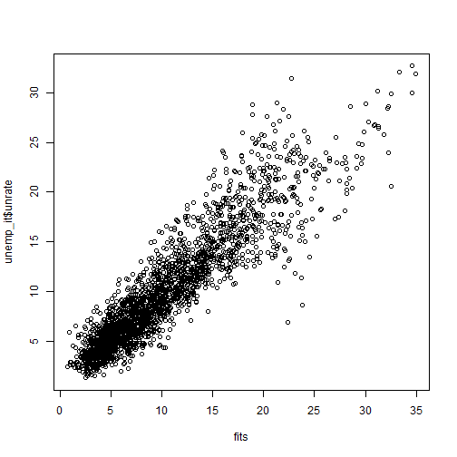

```r
library(pspatreg)
library(spatialreg)
library(spdep)
library(sf)
library(plm)
library(ggplot2)
library(dplyr)
library(splm)
```

# Models for spatial panel data

This section focuses on the semiparametric P-Spline model for spatial panel data. The model may include a smooth spatio-temporal trend, a spatial lag of dependent and independent variables, a time lag of the dependent variable and of its spatial lag, and a time series autoregressive noise. Specifically, we consider a spatio-temporal ANOVA model, disaggregating the trend into spatial and temporal main effects, as well as second- and third-order interactions between them.

The empirical illustration is based on data on regional unemployment in Italy. This example shows that this model represents a valid alternative to parametric methods aimed at disentangling strong and weak cross-sectional dependence when both spatial and temporal heterogeneity are smoothly distributed [see @minguez2020alternative]. The section is organized as follows:

-   Description of dataset, spatial weights matrix and model specifications;

-   Estimation results of linear spatial models and comparison with the results obtained with **splm**;

-   Estimation results of semiparametric spatial models.

## Dataset, spatial weights matrix and model specifications

The package provides the panel data `unemp_it` (an object of class `data.frame`) and the spatial weights matrix `Wsp_it` (a 103 by 103 square matrix). The raw data - a balanced panel with 103 Italian provinces observed for each year between 1996 and 2019 -  can be transformed in a spatial polygonal dataset of class `sf` after having joined the `data.frame` object with the shapefile of Italian provinces:


```r
data(unemp_it, package = "pspatreg")
unemp_it_sf <- st_as_sf(dplyr::left_join(unemp_it, map_it, by = c("prov" = "COD_PRO")))
```

The matrix `Wsp_it` is a standardized inverse distance W matrix. Using `spdep` we transform it in a list of neighbors object:


```r
lwsp_it <- spdep::mat2listw(Wsp_it)
summary(lwsp_it)
```

```
## Characteristics of weights list object:
## Neighbour list object:
## Number of regions: 103 
## Number of nonzero links: 434 
## Percentage nonzero weights: 4.090866 
## Average number of links: 4.213592 
## Link number distribution:
## 
##  1  2  3  4  5  6  7  8  9 
##  7 20 15 16 17 11 10  6  1 
## 7 least connected regions:
## 32 75 78 80 81 90 92 with 1 link
## 1 most connected region:
## 15 with 9 links
## 
## Weights style: M 
## Weights constants summary:
##     n    nn  S0       S1       S2
## M 103 10609 103 74.35526 431.5459
```

## Linear model (comparison with **splm**)

Using these data, we first estimate fully parametric spatial linear autoregressive panel models using the function `pspatfit()` included in the package **pspatreg** (in the default based on the REML estimator) and compare them with the results obtained using the functions provided by the package **splm** (based on the ML estimator).

### Spatial Lag model (SAR). REML estimates using `pspatfit()`

We consider here a fixed effects specification, including both fixed spatial and time effects:

$$y_{it}=\rho \sum_{j=1}^N w_{ij,N} y_{jt} + \sum_{k=1}^K \beta_k x_{k,it}+ \alpha_i+\theta_t+\epsilon_{it}$$

$$\epsilon_{it} \sim i.i.d.(0,\sigma^2_\epsilon)$$


```r
formlin <- unrate ~ empgrowth + partrate + agri + cons + serv

Linear_WITHIN_sar_REML <- pspatfit(formula = formlin,
                   data = unemp_it, 
                   listw = lwsp_it, 
                   demean = TRUE,
                   eff_demean = "twoways",
                   type = "sar",
                   index = c("prov", "year"))

summary(Linear_WITHIN_sar_REML)
```

```
## 
##  Call 
## pspatfit(formula = formlin, data = unemp_it, listw = lwsp_it, 
##     type = "sar", demean = TRUE, eff_demean = "twoways", index = c("prov", 
##         "year"))
## 
##  Parametric Terms 
##             Estimate Std. Error t value  Pr(>|t|)
## empgrowth -0.129739   0.014091 -9.2074 < 2.2e-16
## partrate   0.393087   0.023315 16.8595 < 2.2e-16
## agri      -0.036052   0.027267 -1.3222 0.1862167
## cons      -0.166196   0.044510 -3.7339 0.0001928
## serv       0.012378   0.020597  0.6009 0.5479300
## rho        0.265671   0.018858 14.0880 < 2.2e-16
##              
## empgrowth ***
## partrate  ***
## agri         
## cons      ***
## serv         
## rho       ***
## ---
## Signif. codes:  
## 0 '***' 0.001 '**' 0.01 '*' 0.05 '.' 0.1 ' ' 1
## 
##  Goodness-of-Fit 
##  
##  EDF Total:      6 
##  Sigma: 1.86929 
##  AIC:  5396.53 
##  BIC:  5431.41
```

```r
Linear_WITHIN_sar_ML <- spml(formlin,
               data = unemp_it, 
               index=c("prov","year"),
               listw = lwsp_it,
               model="within",
               effect = "twoways",
               spatial.error="none", 
               lag=TRUE, 
               Hess = FALSE)

round(data.frame(Linear_WITHIN_sar_REML = c(Linear_WITHIN_sar_REML$rho, 
                                            Linear_WITHIN_sar_REML$bfixed), 
                Linear_WITHIN_sar_ML = c(Linear_WITHIN_sar_ML$coefficients[1], 
                                         Linear_WITHIN_sar_ML$coefficients[-1])),3)
```

```
##                 Linear_WITHIN_sar_REML
## rho                              0.266
## fixed_empgrowth                 -0.130
## fixed_partrate                   0.393
## fixed_agri                      -0.036
## fixed_cons                      -0.166
## fixed_serv                       0.012
##                 Linear_WITHIN_sar_ML
## rho                            0.266
## fixed_empgrowth               -0.130
## fixed_partrate                 0.392
## fixed_agri                    -0.037
## fixed_cons                    -0.167
## fixed_serv                     0.012
```
Clearly, both methods give exactly the same results, at least at the third digit level.

Extract coefficients:


```r
coef(Linear_WITHIN_sar_REML)
```

```
##         rho   empgrowth    partrate        agri 
##  0.26567078 -0.12973894  0.39308715 -0.03605243 
##        cons        serv 
## -0.16619608  0.01237770
```

Extract fitted values and residuals:


```r
fits <- fitted(Linear_WITHIN_sar_REML)
resids <- residuals(Linear_WITHIN_sar_REML)
```

Extract log-likelihood and restricted log-likelihhod:


```r
logLik(Linear_WITHIN_sar_REML)
```

```
## 'log Lik.' -2692.266 (df=6)
```

```r
logLik(Linear_WITHIN_sar_REML, REML = TRUE)
```

```
## 'log Lik.' -2711.112 (df=6)
```

Extract the covariance matrix of estimated coefficients. Argument `bayesian` allows to get frequentist (default) or bayesian covariances:


```r
vcov(Linear_WITHIN_sar_REML)
```

```
##               empgrowth      partrate          agri
## empgrowth  1.985464e-04 -8.106848e-05 -3.050359e-06
## partrate  -8.106848e-05  5.436097e-04 -7.233434e-05
## agri      -3.050359e-06 -7.233434e-05  7.434641e-04
## cons       3.032827e-05 -1.649890e-04  1.891487e-04
## serv      -6.861998e-06 -7.891185e-05  2.741340e-04
##                    cons          serv
## empgrowth  3.032827e-05 -6.861998e-06
## partrate  -1.649890e-04 -7.891185e-05
## agri       1.891487e-04  2.741340e-04
## cons       1.981149e-03  2.432964e-04
## serv       2.432964e-04  4.242353e-04
```

```r
vcov(Linear_WITHIN_sar_REML, bayesian = TRUE)
```

```
##               empgrowth      partrate          agri
## empgrowth  1.985464e-04 -8.106848e-05 -3.050359e-06
## partrate  -8.106848e-05  5.436097e-04 -7.233434e-05
## agri      -3.050359e-06 -7.233434e-05  7.434641e-04
## cons       3.032827e-05 -1.649890e-04  1.891487e-04
## serv      -6.861998e-06 -7.891185e-05  2.741340e-04
##                    cons          serv
## empgrowth  3.032827e-05 -6.861998e-06
## partrate  -1.649890e-04 -7.891185e-05
## agri       1.891487e-04  2.741340e-04
## cons       1.981149e-03  2.432964e-04
## serv       2.432964e-04  4.242353e-04
```

A print method to get printed coefficients, standard errors and p-values of parametric terms:


```r
print(Linear_WITHIN_sar_REML)
```

```
##           Estimate Std. Error t value Pr(>|t|)
## empgrowth  -0.1297     0.0141 -9.2074   0.0000
## partrate    0.3931     0.0233 16.8595   0.0000
## agri       -0.0361     0.0273 -1.3222   0.1862
## cons       -0.1662     0.0445 -3.7339   0.0002
## serv        0.0124     0.0206  0.6009   0.5479
## rho         0.2657     0.0189 14.0880   0.0000
```

```r
summary(Linear_WITHIN_sar_REML)
```

```
## 
##  Call 
## pspatfit(formula = formlin, data = unemp_it, listw = lwsp_it, 
##     type = "sar", demean = TRUE, eff_demean = "twoways", index = c("prov", 
##         "year"))
## 
##  Parametric Terms 
##             Estimate Std. Error t value  Pr(>|t|)
## empgrowth -0.129739   0.014091 -9.2074 < 2.2e-16
## partrate   0.393087   0.023315 16.8595 < 2.2e-16
## agri      -0.036052   0.027267 -1.3222 0.1862167
## cons      -0.166196   0.044510 -3.7339 0.0001928
## serv       0.012378   0.020597  0.6009 0.5479300
## rho        0.265671   0.018858 14.0880 < 2.2e-16
##              
## empgrowth ***
## partrate  ***
## agri         
## cons      ***
## serv         
## rho       ***
## ---
## Signif. codes:  
## 0 '***' 0.001 '**' 0.01 '*' 0.05 '.' 0.1 ' ' 1
## 
##  Goodness-of-Fit 
##  
##  EDF Total:      6 
##  Sigma: 1.86929 
##  AIC:  5396.53 
##  BIC:  5431.41
```

```r
summary(Linear_WITHIN_sar_ML)
```

```
## Spatial panel fixed effects lag model
##  
## 
## Call:
## spml(formula = formlin, data = unemp_it, index = c("prov", "year"), 
##     listw = lwsp_it, model = "within", effect = "twoways", lag = TRUE, 
##     spatial.error = "none", Hess = FALSE)
## 
## Residuals:
##      Min.   1st Qu.    Median   3rd Qu.      Max. 
## -8.045700 -1.068404 -0.035768  1.014227  7.816307 
## 
## Spatial autoregressive coefficient:
##        Estimate Std. Error t-value  Pr(>|t|)    
## lambda 0.266004   0.020636   12.89 < 2.2e-16 ***
## 
## Coefficients:
##            Estimate Std. Error t-value  Pr(>|t|)
## empgrowth -0.129530   0.014078 -9.2009 < 2.2e-16
## partrate   0.391597   0.023464 16.6894 < 2.2e-16
## agri      -0.036771   0.027219 -1.3510 0.1767102
## cons      -0.166896   0.044420 -3.7572 0.0001718
## serv       0.012191   0.020559  0.5930 0.5532105
##              
## empgrowth ***
## partrate  ***
## agri         
## cons      ***
## serv         
## ---
## Signif. codes:  
## 0 '***' 0.001 '**' 0.01 '*' 0.05 '.' 0.1 ' ' 1
```
Computing average direct, indirect and total marginal impacts:


```r
imp_parvar_sar <- impactspar(Linear_WITHIN_sar_REML, listw = lwsp_it)
summary(imp_parvar_sar)
```

```
## 
##  Total Parametric Impacts (sar) 
##            Estimate Std. Error   t value Pr(>|t|)
## empgrowth -0.177719   0.018771 -9.467653   0.0000
## partrate   0.536770   0.035194 15.251545   0.0000
## agri      -0.050101   0.038688 -1.294982   0.1953
## cons      -0.228133   0.060288 -3.784020   0.0002
## serv       0.017414   0.028546  0.610017   0.5419
## 
##  Direct Parametric Impacts (sar) 
##            Estimate Std. Error   t value Pr(>|t|)
## empgrowth -0.133728   0.013692 -9.767018   0.0000
## partrate   0.403884   0.024104 16.755808   0.0000
## agri      -0.037687   0.029077 -1.296127   0.1949
## cons      -0.171646   0.045167 -3.800262   0.0001
## serv       0.013115   0.021507  0.609788   0.5420
## 
##  Indirect Parametric Impacts (sar) 
##             Estimate Std. Error    t value Pr(>|t|)
## empgrowth -0.0439908  0.0061601 -7.1412957   0.0000
## partrate   0.1328863  0.0150841  8.8097216   0.0000
## agri      -0.0124135  0.0096898 -1.2810961   0.2002
## cons      -0.0564868  0.0158098 -3.5728936   0.0004
## serv       0.0042989  0.0070732  0.6077681   0.5433
```


### Spatial error within model (SEM). REML estimates using `pspatfit()`:

$$y_{it}= \sum_{k=1}^K \beta_k x_{k,it}+\alpha_i+\theta_t+ \epsilon_{it}$$

$$\epsilon_{it}=\theta \sum_{j=1}^N w_{ij,N}\epsilon_{it}+u_{it}$$

$$u_{it} \sim i.i.d.(0,\sigma^2_u)$$


```r
Linear_WITHIN_sem_REML <- pspatfit(formlin,
                               data = unemp_it, 
                               demean = TRUE,
                               eff_demean = "twoways",
                               listw = lwsp_it, 
                               index = c("prov", "year"),
                               type = "sem")

Linear_WITHIN_sem_ML <- spml(formlin,
                         data = unemp_it, 
                         index=c("prov","year"),
                         listw = lwsp_it,
                         model="within",
                         effect = "twoways",
                         spatial.error="b", 
                         lag=FALSE, 
                         Hess = FALSE)

round(data.frame(Linear_WITHIN_sem_REML = c(Linear_WITHIN_sem_REML$delta, 
                                            Linear_WITHIN_sem_REML$bfixed), 
                 Linear_WITHIN_sem_ML = c(Linear_WITHIN_sem_ML$spat.coef, 
                                          Linear_WITHIN_sem_ML$coefficients[-1])),3)
```

```
##                 Linear_WITHIN_sem_REML
## delta                            0.283
## fixed_empgrowth                 -0.134
## fixed_partrate                   0.400
## fixed_agri                      -0.032
## fixed_cons                      -0.186
## fixed_serv                       0.030
##                 Linear_WITHIN_sem_ML
## delta                          0.283
## fixed_empgrowth               -0.134
## fixed_partrate                 0.399
## fixed_agri                    -0.033
## fixed_cons                    -0.188
## fixed_serv                     0.031
```


## Semiparametric model without spatial trends

Now, we estimate an additive semiparametric model with three parametric linear terms (for `partrate`, `agri`, and `cons`) and two nonparametric smooth terms (for `serv` and `empgrowth`), but without including any control for spatial and temporal autocorrelation and for the spatio-temporal heterogeneity: $$y_{it}= \sum_{k=1}^K \beta_k z_{k,it} + \sum_{\delta=1}^{\Delta} g_\delta(x_{\delta_{it}}) + \epsilon_{it}$$

$$\epsilon_{it} \sim i.i.d.(0,\sigma^2_\epsilon)$$


```r
formgam <- unrate ~ partrate + agri + cons +
                  pspl(serv, nknots = 15) + 
                  pspl(empgrowth, nknots = 20)

gam <- pspatfit(formgam, data = unemp_it)
summary(gam)
```

```
## 
##  Call 
## pspatfit(formula = formgam, data = unemp_it)
## 
##  Parametric Terms 
##               Estimate Std. Error  t value  Pr(>|t|)
## (Intercept) 27.146139   1.350986  20.0936 < 2.2e-16
## partrate    -0.376095   0.018216 -20.6461 < 2.2e-16
## agri         0.346387   0.020058  17.2691 < 2.2e-16
## cons        -0.183073   0.055345  -3.3079 0.0009536
##                
## (Intercept) ***
## partrate    ***
## agri        ***
## cons        ***
## ---
## Signif. codes:  
## 0 '***' 0.001 '**' 0.01 '*' 0.05 '.' 0.1 ' ' 1
## 
##  Non-Parametric Terms 
##                                  EDF
## pspl(serv, nknots = 15)      5.1556
## pspl(empgrowth, nknots = 20) 4.0403
## 
##  Goodness-of-Fit 
##  
##  EDF Total: 13.1959 
##  Sigma: 4.07109 
##  AIC:  9464.61 
##  BIC:  9541.32
```

The same model, but with a spatial autoregressive term (SAR): $$y_{it}= \rho \sum_{j=1}^N w_{ij,N} y_{jt} +\sum_{k=1}^K \beta_k z_{k,it} + \sum_{\delta=1}^{\Delta} g_\delta(x_{\delta_{it}}) + \epsilon_{it}$$

$$\epsilon_{it} \sim i.i.d.(0,\sigma^2_\epsilon)$$


```r
gamsar <- pspatfit(formgam, data = unemp_it, listw = lwsp_it, method = "eigen", type = "sar")
summary(gamsar)
```

```
## 
##  Call 
## pspatfit(formula = formgam, data = unemp_it, listw = lwsp_it, 
##     type = "sar", method = "eigen")
## 
##  Parametric Terms 
##               Estimate Std. Error  t value  Pr(>|t|)
## (Intercept) 10.896654   0.940776  11.5826 < 2.2e-16
## partrate    -0.164349   0.011958 -13.7440 < 2.2e-16
## agri         0.093816   0.013100   7.1613 1.051e-12
## cons        -0.092744   0.036110  -2.5684   0.01028
## rho          0.658605   0.011280  58.3864 < 2.2e-16
##                
## (Intercept) ***
## partrate    ***
## agri        ***
## cons        *  
## rho         ***
## ---
## Signif. codes:  
## 0 '***' 0.001 '**' 0.01 '*' 0.05 '.' 0.1 ' ' 1
## 
##  Non-Parametric Terms 
##                                  EDF
## pspl(serv, nknots = 15)      7.1105
## pspl(empgrowth, nknots = 20) 5.4779
## 
##  Goodness-of-Fit 
##  
##  EDF Total: 17.5884 
##  Sigma: 3.56178 
##  AIC:  7784.16 
##  BIC:  7886.4
```

and a spatial error term: $$y_{it}= \sum_{k=1}^K \beta_k z_{k,it} + \sum_{\delta=1}^{\Delta} g_\delta(x_{\delta_{it}}) + \epsilon_{it}$$

$$\epsilon_{it} = \delta \sum_{j=1}^N w_{ij,N}\epsilon_{it}+u_{it}$$

$$u_{it} \sim i.i.d.(0,\sigma^2_u)$$


```r
gamsem <- pspatfit(formgam, data = unemp_it, listw = lwsp_it, method = "eigen", type = "sem")
```

```
## Error in solve(H) : 
##   Lapack dgecon(): system computationally singular, reciprocal condition number = 3.03277e-30
## Error in solve(H) : 
##   Lapack dgecon(): system computationally singular, reciprocal condition number = 2.2863e-30
## Error in solve(H) : 
##   Lapack dgecon(): system computationally singular, reciprocal condition number = 2.0192e-30
```

```r
summary(gamsem)
```

```
## 
##  Call 
## pspatfit(formula = formgam, data = unemp_it, listw = lwsp_it, 
##     type = "sem", method = "eigen")
## 
##  Parametric Terms 
##               Estimate Std. Error  t value Pr(>|t|)
## (Intercept) 19.242400   1.161474  16.5672  < 2e-16
## partrate    -0.216734   0.021048 -10.2971  < 2e-16
## agri         0.020094   0.015038   1.3362  0.18160
## cons        -0.080241   0.039193  -2.0473  0.04073
## delta        0.751408   0.010967  68.5128  < 2e-16
##                
## (Intercept) ***
## partrate    ***
## agri           
## cons        *  
## delta       ***
## ---
## Signif. codes:  
## 0 '***' 0.001 '**' 0.01 '*' 0.05 '.' 0.1 ' ' 1
## 
##  Non-Parametric Terms 
##                                  EDF
## pspl(serv, nknots = 15)      7.8634
## pspl(empgrowth, nknots = 20) 6.9949
## 
##  Goodness-of-Fit 
##  
##  EDF Total: 19.8583 
##  Sigma: 4.86868 
##  AIC:  8102.27 
##  BIC:  8217.7
```

We can control for spatio-temporal heterogeneity by including a PS-ANOVA spatial trend in 3d. The interaction terms (`f12`,`f1t`,`f2t` and `f12t`) with nested basis. Remark: `nest_sp1`, `nest_sp2` and `nest_time` must be divisors of `nknots`.

$$y_{it}= \sum_{k=1}^K \beta_k z_{k,it} + \sum_{\delta=1}^{\Delta} g_\delta(x_{\delta_{it}}) + 
f_1(s_{1i})+f_2(s_{2i})+f_{\tau}(\tau_t)+ \\ f_{1,2}(s_{1i},s_{2i})+f_{1,\tau}(s_{1i},\tau_t)+f_{2,\tau}+(s_{2i},\tau_t)+f_{1,2,\tau}(s_{1i},s_{2i},\tau_t)+\epsilon_{it}$$

$$\epsilon_{it} \sim i.i.d.(0,\sigma^2_\epsilon)$$


```r
form3d_psanova <- unrate ~ partrate + agri + cons +
                  pspl(serv, nknots = 15) + 
                  pspl(empgrowth, nknots = 20) +
                  pspt(long, lat, year, 
                       nknots = c(18,18,8), psanova = TRUE, 
                       nest_sp1 = c(1, 2, 3), 
                       nest_sp2 = c(1, 2, 3),
                       nest_time = c(1, 2, 2))

sp3danova <- pspatfit(form3d_psanova, data = unemp_it,
                    listw = lwsp_it, method = "Chebyshev")  

summary(sp3danova)
```

```
## 
##  Call 
## pspatfit(formula = form3d_psanova, data = unemp_it, listw = lwsp_it, 
##     method = "Chebyshev")
## 
##  Parametric Terms 
##             Estimate Std. Error t value  Pr(>|t|)
## Intercept  4.016850   3.015789  1.3319    0.1830
## partrate   0.152599   0.021014  7.2617 5.232e-13
## agri      -0.018676   0.017880 -1.0445    0.2964
## cons      -0.041459   0.038782 -1.0690    0.2852
##              
## Intercept    
## partrate  ***
## agri         
## cons         
## ---
## Signif. codes:  
## 0 '***' 0.001 '**' 0.01 '*' 0.05 '.' 0.1 ' ' 1
## 
##  Non-Parametric Terms 
##                                  EDF
## pspl(serv, nknots = 15)      7.8138
## pspl(empgrowth, nknots = 20) 8.0551
## 
##  Non-Parametric Spatio-Temporal Trend 
##         EDF
## f1   10.827
## f2    9.756
## ft    7.776
## f12  45.218
## f1t   4.282
## f2t  22.811
## f12t 77.915
## 
##  Goodness-of-Fit 
##  
##  EDF Total: 205.454 
##  Sigma: 1.53927 
##  AIC:  5993.12 
##  BIC:  7187.38
```

A semiparametric model with a PS-ANOVA spatial trend in 3d with the exclusion of some ANOVA components


```r
form3d_psanova_restr <- unrate ~ partrate + agri + cons +
                        pspl(serv, nknots = 15) + 
                        pspl(empgrowth, nknots = 20) +
                        pspt(long, lat, year, 
                         nknots = c(18,18,8), psanova = TRUE, 
                         nest_sp1 = c(1, 2, 3), 
                         nest_sp2 = c(1, 2, 3),
                         nest_time = c(1, 2, 2),
                         f1t = FALSE, f2t = FALSE)

sp3danova_restr <- pspatfit(form3d_psanova_restr, data = unemp_it,
                    listw = lwsp_it, method = "Chebyshev")  

summary(sp3danova_restr)
```

```
## 
##  Call 
## pspatfit(formula = form3d_psanova_restr, data = unemp_it, listw = lwsp_it, 
##     method = "Chebyshev")
## 
##  Parametric Terms 
##             Estimate Std. Error t value  Pr(>|t|)
## Intercept  4.640481   3.012467  1.5404    0.1236
## partrate   0.152941   0.020992  7.2856 4.404e-13
## agri      -0.025368   0.017801 -1.4251    0.1543
## cons      -0.024259   0.038929 -0.6232    0.5332
##              
## Intercept    
## partrate  ***
## agri         
## cons         
## ---
## Signif. codes:  
## 0 '***' 0.001 '**' 0.01 '*' 0.05 '.' 0.1 ' ' 1
## 
##  Non-Parametric Terms 
##                                  EDF
## pspl(serv, nknots = 15)      7.7381
## pspl(empgrowth, nknots = 20) 8.0137
## 
##  Non-Parametric Spatio-Temporal Trend 
##          EDF
## f1    10.775
## f2     9.678
## ft     7.755
## f12   45.335
## f1t    0.000
## f2t    0.000
## f12t 113.620
## 
##  Goodness-of-Fit 
##  
##  EDF Total: 211.915 
##  Sigma: 1.53573 
##  AIC:  6041.81 
##  BIC:  7273.63
```

Now we add a spatial lag (*sar*) and temporal correlation in the noise of PSANOVA 3d model.

$$y_{it}= \rho \sum_{j=1}^N w_{ij,N} y_{jt}+\sum_{k=1}^K \beta_k z_{k,it} + \sum_{\delta=1}^{\Delta} g_\delta(x_{\delta_{it}}) + 
f_1(s_{1i})+f_2(s_{2i})+f_{\tau}(\tau_t)+ \\ f_{1,2}(s_{1i},s_{2i})+f_{1,\tau}(s_{1i},\tau_t)+f_{2,\tau}+(s_{2i},\tau_t)+f_{1,2,\tau}(s_{1i},s_{2i},\tau_t)+\epsilon_{it}$$

$$\epsilon_{it} \sim i.i.d.(0,\sigma^2_\epsilon)$$


```r
sp3danovasarar1 <- pspatfit(form3d_psanova_restr, data = unemp_it, 
                              listw = lwsp_it, method = "Chebyshev", 
                              type = "sar", cor = "ar1")  
summary(sp3danovasarar1)
```

```
## 
##  Call 
## pspatfit(formula = form3d_psanova_restr, data = unemp_it, listw = lwsp_it, 
##     type = "sar", method = "Chebyshev", cor = "ar1")
## 
##  Parametric Terms 
##              Estimate Std. Error t value  Pr(>|t|)
## Intercept  5.0678900  3.0611564  1.6555   0.09795
## partrate   0.1485784  0.0205497  7.2302 6.557e-13
## agri      -0.0349079  0.0201957 -1.7285   0.08404
## cons      -0.0092429  0.0411776 -0.2245   0.82242
## rho        0.0453863  0.0217972  2.0822   0.03744
## phi        0.3149515  0.0138863 22.6807 < 2.2e-16
##              
## Intercept .  
## partrate  ***
## agri      .  
## cons         
## rho       *  
## phi       ***
## ---
## Signif. codes:  
## 0 '***' 0.001 '**' 0.01 '*' 0.05 '.' 0.1 ' ' 1
## 
##  Non-Parametric Terms 
##                                 EDF
## pspl(serv, nknots = 15)      6.933
## pspl(empgrowth, nknots = 20) 7.790
## 
##  Non-Parametric Spatio-Temporal Trend 
##          EDF
## f1    10.202
## f2     9.522
## ft     7.855
## f12   43.121
## f1t    0.000
## f2t    0.000
## f12t 102.109
## 
##  Goodness-of-Fit 
##  
##  EDF Total: 197.532 
##  Sigma: 1.56498 
##  AIC:  5582.27 
##  BIC:  6730.48
```

Examples of LR test:


```r
anova(gam, gamsar, lrtest = TRUE)
```

```
##         logLik rlogLik    edf    AIC    BIC LRtest
## gam    -4719.1 -4728.3 13.196 9464.6 9559.7       
## gamsar -3874.5 -3885.9 17.588 7784.2 7909.0   1685
##        p.val
## gam         
## gamsar     0
```

```r
anova(gam, gamsar, lrtest = TRUE)
```

```
##         logLik rlogLik    edf    AIC    BIC LRtest
## gam    -4719.1 -4728.3 13.196 9464.6 9559.7       
## gamsar -3874.5 -3885.9 17.588 7784.2 7909.0   1685
##        p.val
## gam         
## gamsar     0
```

```r
anova(gamsar, gamsem, lrtest = FALSE)
```

```
##         logLik rlogLik    edf    AIC    BIC
## gamsar -3874.5 -3885.9 17.588 7784.2 7909.0
## gamsem -4031.3 -4041.6 19.858 8102.3 8238.2
```

```r
anova(gam, sp3danova_restr, lrtest = TRUE)
```

```
##                  logLik rlogLik     edf    AIC
## gam             -4719.1 -4728.3  13.196 9464.6
## sp3danova_restr -2809.0 -2808.1 211.915 6041.8
##                    BIC LRtest p.val
## gam             9559.7             
## sp3danova_restr 7252.9 3840.4     0
```

```r
anova(sp3danova_restr, sp3danovasarar1, lrtest = FALSE)
```

```
##                  logLik rlogLik    edf    AIC
## sp3danova_restr -2809.0 -2808.1 211.91 6041.8
## sp3danovasarar1 -2593.6 -2593.1 197.53 5582.3
##                    BIC
## sp3danova_restr 7252.9
## sp3danovasarar1 6713.1
```

Plot of non-parametric terms


```r
list_varnopar <- c("serv", "empgrowth")
terms_nopar <- fit_terms(sp3danova_restr, list_varnopar)
names(terms_nopar)
```

```
## [1] "fitted_terms"          
## [2] "se_fitted_terms"       
## [3] "fitted_terms_fixed"    
## [4] "se_fitted_terms_fixed" 
## [5] "fitted_terms_random"   
## [6] "se_fitted_terms_random"
```

```r
plot_terms(terms_nopar, unemp_it, conflevel = 0.95)
```


### Parametric and nonparametric direct, indirect and total impacts


```r
imp_nparvar <- impactspar(sp3danovasarar1, listw = lwsp_it)
summary(imp_nparvar)
```

```
## 
##  Total Parametric Impacts (sar) 
##           Estimate Std. Error   t value Pr(>|t|)
## partrate  0.156332   0.022276  7.017959   0.0000
## agri     -0.035473   0.021602 -1.642095   0.1006
## cons     -0.010991   0.043010 -0.255546   0.7983
## 
##  Direct Parametric Impacts (sar) 
##           Estimate Std. Error   t value Pr(>|t|)
## partrate  0.149229   0.021038  7.093211   0.0000
## agri     -0.033849   0.020609 -1.642450   0.1005
## cons     -0.010498   0.041051 -0.255723   0.7982
## 
##  Indirect Parametric Impacts (sar) 
##             Estimate  Std. Error     t value
## partrate  0.00710342  0.00348963  2.03558132
## agri     -0.00162388  0.00131103 -1.23862314
## cons     -0.00049335  0.00215887 -0.22852314
##          Pr(>|t|)
## partrate   0.0418
## agri       0.2155
## cons       0.8192
```


```r
imp_nparvar <- impactsnopar(sp3danovasarar1, listw = lwsp_it, viewplot = TRUE)
```


### Spatial trend 3d (ANOVA).

Plot of spatial trends in 1996, 2005 and 2019


```r
plot_sp3d(sp3danovasarar1, data = unemp_it_sf, 
          time_var = "year", time_index = c(1996, 2005, 2019),
          addmain = FALSE, addint = FALSE)
```


Plot of spatio-temporal trend, main effects and interaction effect for a year:


```r
plot_sp3d(sp3danovasarar1, data = unemp_it_sf, 
          time_var = "year", time_index = c(2019),
          addmain = TRUE, addint = TRUE)
```


Plot of temporal trend for each province:


```r
plot_sptime(sp3danovasarar1, data = unemp_it, 
            time_var = "year", reg_var = "prov")
```


Plots of *fitted* and *residuals* of the last model:


```r
fits <- fitted(sp3danovasarar1)
resids <- residuals(sp3danovasarar1)
plot(fits, unemp_it$unrate)
```



```r
plot(fits, resids)
```


# References
